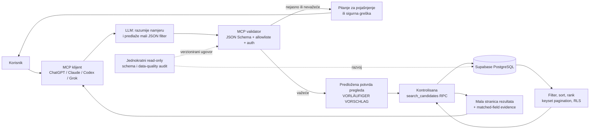

# Implementacijski brief: Supabase CRM MCP

- Status dokumenta: prijedlog za tehnički dizajn i kontrolisanu implementaciju
- Jezik: B/H/S latinica
- Supabase projekt: `https://project-redacted.invalid`
- Procijenjeni obim: približno 200.000 kandidata (projektna procjena, DURCH DISCOVERY ZU PRÜFEN)
- Projektni endpoint iznad: ARBEITSANNAHME; porijeklo i dozvola dokumentovanja nisu potvrđeni ovim auditom.
- Korekcija 2026-09-11: prema korisničkom odobrenju nalaza audita; bez implementacije ili pristupa bazi.

Opseg: dokumentacija; bez pristupa produkcijskim podacima i bez promjena baze

## Sadržaj

- [Izvršni sažetak](#izvršni-sažetak)
- [Problem](#problem)
- [Ciljevi i ne-ciljevi](#ciljevi-i-ne-ciljevi)
- [Pretpostavke i poznate nepoznanice](#pretpostavke-i-poznate-nepoznanice)
- [Ciljna arhitektura](#ciljna-arhitektura)
- [Jednokratni discovery i produkcijski runtime](#jednokratni-discovery-i-produkcijski-runtime)
- [Must-have zahtjevi](#must-have-zahtjevi)
- [Good-to-have zahtjevi](#good-to-have-zahtjevi)
- [Nice-to-have zahtjevi](#nice-to-have-zahtjevi)
- [Faze implementacije i isporučivi rezultati](#faze-implementacije-i-isporučivi-rezultati)
- [Kriteriji prihvata](#kriteriji-prihvata)
- [Test-matrica](#test-matrica)
- [Opservabilnost i operacije](#opservabilnost-i-operacije)
- [Rollout i rollback](#rollout-i-rollback)
- [Rizici i mjere](#rizici-i-mjere)
- [Otvorena pitanja i nedostajuće informacije](#otvorena-pitanja-i-nedostajuće-informacije)
- [Potencijalno zaboravljene teme](#potencijalno-zaboravljene-teme)
- [Dnevnik odluka](#dnevnik-odluka)
- [Preporučeni minimalni release](#preporučeni-minimalni-release)
- [Službene reference](#službene-reference)
- [Handoff checklista](#handoff-checklista)

## Izvršni sažetak

CRM s približno 200.000 zapisa kandidata treba dobiti siguran MCP sloj preko kojeg
ChatGPT, Claude, Codex, Grok i drugi MCP-kompatibilni klijenti mogu postavljati
upite prirodnim jezikom na bosanskom, njemačkom i engleskom. Primjeri uključuju
pronalaženje mehaničara prema dobnom rasponu, minimalnom iskustvu, lokaciji,
jezicima, vještinama i dostupnosti.

Preporučena arhitektura ne šalje bazu LLM-u i ne dopušta LLM-u da piše ili izvršava
SQL. LLM prevodi korisničku namjeru u mali, strogo validiran JSON filter. MCP
poziva kontrolisanu PostgreSQL funkciju/RPC, a baza filtrira, sortira, rangira i
paginira rezultate. Klijentu se vraća samo mala stranica stvarnih zapisa i dokaz
zbog čega je svaki zapis odgovarao upitu. Obrazac je funkcionalno sličan jQuery
DataTables server-side obradi.

Jednokratni, read-only audit sheme potreban je u razvojnoj fazi. Njegov rezultat
postaje verzioniran ugovor. Produkcijski MCP ne smije iznova otkrivati shemu pri
svakom upitu. Minimalni prvi release obuhvata sve stavke označene kao Must-have;
dodatne optimizacije uvode se tek prema mjerenjima. Release 1 je potpuno bez
izlaza kontaktnih podataka, uključujući pojedinačni profil. Odobrenje pristupa kontaktima
i CONTACT-02 nisu Must-have za Release 1, nego kasnija zasebno odobrena faza.
Predložene filterdetalje i nepotpuni JSON nacrt ne treba tumačiti kao konačan
ugovor; Q8.5 je u cijelosti OFFEN.

## Problem

Naivni pristup u kojem bi se desetine ili stotine hiljada redova pretvorile u JSON
i poslale modelu nije prihvatljiv zbog veličine konteksta, latencije, troška,
privatnosti i mogućnosti haluciniranja. Slobodno generisani SQL nosi dodatne rizike:
SQL injection, preskakanje RLS pravila, slučajno otkrivanje kontaktnih ili osjetljivih
podataka, nekontrolisane skupe upite i nestabilno ponašanje između LLM klijenata.

Potrebno je razdvojiti razumijevanje korisničke namjere od autoritativnog
pretraživanja. Model smije strukturirati zahtjev, ali samo baza smije odlučiti koji
stvarni zapisi zadovoljavaju kriterije. Rezultat mora biti ponovljiv, ograničen,
objašnjiv i provjerljiv.

## Ciljevi i ne-ciljevi

### Ciljevi

- Omogućiti prirodno pretraživanje kandidata na B/H/S, njemačkom i engleskom.
- Sigurno posluživati približno 200.000 kandidata bez masovnog prijenosa podataka.
- Primijeniti determinističke filtere, rangiranje i stabilnu paginaciju u PostgreSQL-u.
- Izložiti mali, verzioniran MCP ugovor kompatibilan s više klijenata.
- Vraćati samo stvarne zapise sa stabilnim ID-ovima i dokazima poklapanja.
- Provesti autentikaciju, autorizaciju, tenant izolaciju i kontrolu osjetljivih kolona.
- Uspostaviti mjerljive sigurnosne, kvalitetne i performansne acceptance gateove.
- Omogućiti kontrolisano proširenje bez vezivanja za jedan LLM ili vendor.

### Ne-ciljevi

- Slanje cijele baze ili velikih dumpova LLM-u.
- Omogućavanje runtime LLM-u da generiše ili izvršava proizvoljni SQL.
- Automatsko donošenje odluka o zapošljavanju bez ljudskog pregleda.
- Pretpostavljanje nepoznatih vrijednosti iz nepotpunih profila.
- Uvođenje vektorske baze, cachea, read replike ili eksternog search enginea bez
  dokazanog problema i benchmarka.
- Mijenjanje postojeće Supabase baze u okviru ovog dokumentacijskog zadatka.
- Definisanje stvarnih naziva tabela, kolona ili odnosa prije read-only audita.

## Pretpostavke i poznate nepoznanice

### Projektna osnova i status dokaza

Fizičke i količinske tvrdnje nisu rezultat discoveryja. Prihvaćene arhitekturne
granice ostaju odvojene od radnih pretpostavki o postojećem sistemu.

| Tema | Tvrdnja i status |
|---|---|
| Platforma | Projektna osnova: Supabase/PostgreSQL; stvarno okruženje je DURCH DISCOVERY ZU PRÜFEN. |
| Projekt | Endpoint je naveden u zaglavlju; ARBEITSANNAHME. Porijeklo i dozvola dokumentovanja ostaju OFFEN; nije potvrđen pristup niti vlasništvo. |
| Obim | Projektna procjena približno 200.000 kandidata; DURCH DISCOVERY ZU PRÜFEN. Korisnik je naveo 179 tabela; broj nije tehnički potvrđen. |
| Klijenti | Cilj uključuje ChatGPT, Claude, Codex, Grok i druge MCP klijente. |
| Jezici upita | B/H/S, njemački i engleski. |
| Granica podataka | Cijela baza se nikada ne šalje LLM-u kao JSON. |
| Runtime granica | LLM ne generiše niti izvršava proizvoljni SQL. |

### Radne pretpostavke koje se moraju potvrditi

- Postoji stabilan interni identifikator kandidata koji se može sigurno izložiti kao
  javni/stabilni MCP ID ili mapirati na pseudonimizirani ID.
- Baza sadrži ili može izvesti podatke za zanimanje, lokaciju, jezike, vještine,
  iskustvo i dostupnost.
- Moguće je kreirati zaseban read-only identitet i kontrolisane RPC funkcije.
- Klijenti mogu slati autentificirane MCP pozive i prikazati strukturirane greške.

Ni jedna od ovih pretpostavki nije činjenica o trenutnoj shemi. Ako audit pokaže
suprotno, dizajn se prilagođava i odluka se zapisuje u dnevnik odluka.

## Ciljna arhitektura



### Tok produkcijskog upita

VORLÄUFIGER VORSCHLAG za tok potvrde: prije svake nove ili izmijenjene
pretrage prikazati filtere i zatražiti potvrdu, zatim ponoviti validaciju.
Opća obaveza potvrde još nije konačna odluka. Q7 zasebno obavezno zahtijeva
saglasnost prije izvršavanja olabavljene pretrage.

1. MCP klijent autentificira korisnika i prosljeđuje tekstualni zahtjev.
2. LLM prepoznaje jezik i prevodi namjeru u predložene strukturirane filtere.
3. MCP normalizira termine kroz odobrenu višejezičnu taksonomiju.
4. JSON Schema odbija nepoznata polja, pogrešne tipove, preširoke raspona i
   nedozvoljene vrijednosti.
5. Ako je upit materijalno nejasan, MCP vraća zahtjev za pojašnjenje bez poziva bazi.
6. U predloženom toku korisnik potvrđuje pregled, a MCP ponovo validira
   filtere i primjenjuje identitet, tenant kontekst, rate limit, timeout i result cap.
7. MCP poziva samo unaprijed definisanu, parametriziranu PostgreSQL RPC funkciju.
8. PostgreSQL filtrira, rangira i paginira te vraća minimalni skup kolona.
9. MCP vraća rezultate, interpretirane filtere, dokaze poklapanja i sljedeći cursor.

### Granice povjerenja

| Zona | Smije | Ne smije |
|---|---|---|
| LLM | Prevesti tekst u dozvoljeni JSON; tražiti pojašnjenje. | Pisati SQL; vidjeti cijelu bazu; izmišljati vrijednosti. |
| MCP | Validirati, autorizirati i pozvati allowlistane RPC funkcije. | Zaobići RLS; vratiti neograničene rezultate ili skrivene kolone. |
| PostgreSQL | Autoritativno filtrirati, rangirati, paginirati i provesti RLS. | Vratiti kolone izvan ugovora ili tenant opsega. |
| Administrator | Auditirati uz odobrenu, vremenski ograničenu ulogu. | Koristiti produkcijske podatke u razvoju bez pravne i sigurnosne kontrole. |

## Jednokratni discovery i produkcijski runtime

| Osobina | Jednokratni read-only discovery | Produkcijski runtime MCP |
|---|---|---|
| Svrha | Razumjeti stvarnu shemu i dizajnirati stabilan ugovor. | Izvršavati isključivo odobrene pretrage. |
| Pristup | Vremenski ograničen, read-only, auditiran. | Stalni identitet najmanjih privilegija. |
| Shema | Inventarizira metapodatke i mali anonimizirani uzorak. | Ne rediscovera shemu po upitu. |
| SQL | Razvojni agent može koristiti unaprijed pregledane read-only audit upite. | LLM nikada ne generiše ni izvršava proizvoljni SQL. |
| Izlaz | Verzija sheme, mapiranje, rizici, plan indeksa i ugovor. | Mala stranica rezultata po verzioniranom ugovoru. |
| Učestalost | Prije dizajna te kontrolisano nakon migracija. | Za svaki korisnički search/profile/options poziv. |

Discovery se završava potpisanim artefaktima: inventarom, data dictionaryjem,
mapiranjem na kanonski model, data-quality izvještajem, pregledom RLS-a, analizom
planova upita i odlukama o ugovoru. Produkcija koristi te artefakte i provjerava
kompatibilnost verzije sheme pri deployu ili health checku, a ne kroz slobodno
istraživanje baze tokom korisničkog zahtjeva.

### Razvojni Supabase plugin i skills

Službeni Supabase plugin, MCP i projektni agent skills pripadaju razvojnom toku,
ne produkcijskom ugovoru. Skills daju ažurne procedure za Supabase/PostgreSQL,
ali ne otkrivaju niti potvrđuju fizičku shemu. Plugin/MCP može ubrzati kasniji
odobreni inventar i determinističke Advisor provjere, ali ne postaje Runtime-
Such-MCP niti odvojeni Profilverwaltungs-MCP.

Live-MCP se smije koristiti samo nakon vlastitog gatea koji dokazuje tačan
projektni scope, `read_only=true`, minimalne feature grupe, najmanje privilegije,
ručni review svakog poziva, SQL allowlistu, rezultatne limite i siguran izlaz.
Više instaliranih distribucija koje pokazuju na isti Supabase app/MCP ne čine
odvojene identitete ili trust boundaryje. Trenutni Gate B ostaje vezan za lokalni
`psql` launcher dok nova gate verzija izričito ne odobri drugi put.

## Must-have zahtjevi

### 1. Read-only inventar i data-quality audit

Audit mora evidentirati bez izmjena:

- sve relevantne sheme, tabele, kolone, tipove, nullable/default pravila i ključeve;
- primarne i strane ključeve, relacije, kardinalnosti i junction tabele;
- viewove, materialized viewove, funkcije/RPC-je i njihove privilegije;
- postojeće B-tree, GIN, GiST i druge indekse, uključujući veličinu i korištenje;
- RLS status, politike, role, grantove i tenant ograničenja;
- procijenjene i stvarne brojeve redova te veličine relevantnih tabela;
- mali anonimizirani uzorak dovoljan za provjeru formata, bez kontakata, CV teksta,
  identifikacionih brojeva ili drugih nepotrebnih ličnih podataka;
- reprezentativne `EXPLAIN (ANALYZE, BUFFERS)` planove u sigurnom testnom okruženju
  ili na odobrenim read-only upitima uz kontrolu opterećenja.

Data-quality izvještaj mora kvantificirati:

- nedostajuće vrijednosti po ključnom filteru;
- nekonzistentne formate datuma, lokacije, jezika, zanimanja i dostupnosti;
- duplikate i vjerovatne duplikate, uz dokumentovano pravilo identifikacije;
- zastarjele profile prema definisanom `updated_at` ili izvoru svježine;
- konfliktne podatke između profila, CV-a i povezanih tabela;
- nepouzdane izvedene vrijednosti, posebno trajanje iskustva i dostupnost.

Auditni rezultat ne smije sadržavati sirove tajne ili nepotrebni PII. Izvještaji
koriste agregate, pseudonimizirane ID-ove i anonimizirane primjere.

### 2. Kanonski i normalizirani model kandidata

Stabilni search model treba mapirati stvarnu shemu na sljedeće koncepte, bez
pretpostavljanja kako se danas zovu fizičke tabele:

| Koncept | Zahtjev |
|---|---|
| Identitet | Stabilan, nepredvidiv candidate ID; bez emaila ili telefona kao ključa. |
| Dob | Čuvati datum rođenja ako je zakonito; dob računati na referentni datum, ne pohranjivati kao zastarjeli broj. |
| Iskustvo | VORLÄUFIGER VORSCHLAG: sačuvati originalni tekst i unaprijed normalizirati intervale. Q8.5 je u cijelosti OFFEN: ukupno ili relevantno iskustvo, preklapanja i praznine nisu odlučeni. |
| Ausbildungsberufe | DURCH DISCOVERY ZU PRÜFEN: postoje li kontrolisani CRM ID-ovi. Njihova upotreba, ako su prikladni, je VORLÄUFIGER VORSCHLAG; ne izvoditi vrijednosti bez odobrenog pravila. |
| Zanimanja iz iskustva | Kanonski ID i odobreni nazivi/sinonimi na B/H/S, DE i EN, odvojeni od originalnog teksta. |
| Tätigkeitsarten | Kontrolisani ID-ovi za stvarno obavljane vrste poslova, odvojeni od formalnog zanimanja i obrazovanja. |
| Berufssuchprofile | Imenovane, verzionirane grupe koje neekskluzivno referenciraju Ausbildungsberufe, Erfahrungsberufe i Tätigkeitsarten. |
| Lokacije | Standardizirani grad, regija i država; dokumentovan tretman dijakritike i historijskih naziva. |
| Jezici | Kanonski jezik i standardizirani nivo znanja; izvor i pouzdanost nivoa. |
| Vještine | Kanonski skill ID, sinonimi i eventualna verifikacija/provenijencija. |
| Dostupnost | Kontrolisani status i vremenska oznaka; zastarjeli status se ne tretira kao aktuelan. |
| Svježina | Autoritativni `updated_at` i, gdje je potrebno, datum zadnje potvrde kandidata. |

Višejezična taksonomija mora imati kanonski ID, pojam, jezik, sinonim, status
odobrenja, vlasnika promjene i verziju. Termin poput "mehaničar", "Mechaniker" ili
"mechanic" mapira se na isti koncept samo nakon ljudski odobrene taksonomske
odluke. Slobodni LLM sinonimi ne smiju tiho širiti filter.

Berufssuchprofil ne posjeduje zanimanje i ne premješta ga iz taksonomije.
Profil-članstvo je veza više-prema-više: isti kontrolisani pojam može pripadati
većem broju profila i ostaje direktno pretraživ. Profil mora čuvati stabilni ID,
višejezični naziv, opis namjene, tip i ID svakog člana, verziju, status, razlog
izmjene, autora, pregledavača i vrijeme objave.

### 2.1 Kontrolisana semantika filtera

**Potvrđeno:** nenavedene kategorije su neaktivne; zahtjev za iskustvom ne
zahtijeva nenavedenu Ausbildung. Q8.4 potvrđuje koncept profila, ne dokazuje
svaki rekonstruisani detalj. Q7 zabranjuje novu olabavljenu pretragu bez saglasnosti.

**VORLÄUFIGER VORSCHLAG / Rekonstruktionslücke:** sljedeća detaljna pravila
operatora i opće potvrde nisu pojedinačno dokazana izvornom listom preporuka.
Ne predstavljaju konačno odobren ugovor. Postojeće zabrane izmišljanja podataka
i automatskog objavljivanja ostaju važeće.

- Različite kategorije se povezuju sa `AND`.
- Raspon zahtijeva istovremeno ispunjenje donje i gornje granice.
- Više zanimanja, lokacija ili vrijednosti dostupnosti su zadano alternative
  (`ANY`).
- Za jezike i vještine koristi se izričito `ANY` ili `ALL` iz korisničkog
  zahtjeva; nejasna lista zahtijeva potvrdu.
- Isključivanje se primjenjuje samo kada je korisnik izričito zatražio `NOT`.
- Nepoznata vrijednost ne ispunjava pozitivan obavezni filter i ne smije se
  procijeniti iz stereotipa ili nepovezanih podataka.
- Kategorija koju korisnik nije naveo ostaje neaktivna i ne ograničava rezultat.
  Zanimanje uz zahtjev za iskustvom ne aktivira filter formalnog obrazovanja ako
  Ausbildung ili kvalifikacija nisu izričito tražene.
- Svaka nova ili izmijenjena pretraga zahtijeva pregled strukturiranih filtera,
  proširenih članova profila i operatora, zatim eksplicitnu potvrdu i novu
  serversku validaciju prije jednog poziva bazi.
- Filter i članstvo profila se ne smiju tiho promijeniti između potvrde i
  izvršenja; zahtjev je vezan za potvrđenu verziju profila.

**VORLÄUFIGER VORSCHLAG:** normalizirati freetext unaprijed ili pri unosu/izmjeni
uz očuvan original. Postojanje takvih podataka je DURCH DISCOVERY ZU PRÜFEN.
Prema prihvaćenom ADR-0003 automatska ili LLM klasifikacija proizvodi prijedlog;
samo odobreno mapiranje postaje aktivno. Nepoznate vrijednosti se ne izmišljaju.
Da li i kako nejasan unos ulazi u iskustvo nije odlučeno: cijela Q8.5, uključujući
izbor ukupnog ili relevantnog iskustva i vezu zanimanja i djelatnosti, ostaje OFFEN u
[ADR-0002](decisions/0002-search-design-interview.md).

### 3. Minimalni MCP interfejs

Produkcijski Runtime-Such-MCP izlaže samo tri osnovna alata:

| Alat | Namjena | Osnovni izlaz |
|---|---|---|
| `search_candidates(filters, sort, limit, cursor)` | Pretraživanje i rangiranje. | Interpretirani filteri, mala stranica sažetaka, match evidence i sljedeći cursor. |
| `get_candidate_profile(candidate_id)` | Dohvat jednog autoriziranog profila. | Dozvoljeni detalji profila; Release 1 uvijek bez kontakata. |
| `get_filter_options(field, query)` | Autocomplete i razrješenje termina ili profila. | Ograničena lista kanonskih opcija, Berufssuchprofila i ID-ova bez kandidatskih podataka. |

Alati ne prihvataju SQL fragmente, nazive tabela, nazive kolona ni arbitrary
expression objekte. `get_candidate_profile` ne vraća kontaktne podatke ako korisnik
nema eksplicitnu ulogu i potvrđen poslovni razlog u kasnijoj, zasebno odobrenoj
fazi. U Releaseu 1 kontakti se ne vraćaju ni uz takvu ulogu ili razlog. Masovni export nije dio osnovnog
search alata.

### 3.1 Odvojeni Profilverwaltungs-MCP

Nakon read-only discoveryja i odobrenja kanonskog modela uvodi se odvojeni
interni MCP za upravljanje Berufssuchprofilima. On ne pretražuje niti mijenja
kandidate. Njegova je svrha:

- stvaranje i čitanje nacrta i verzija profila;
- pretraga kontrolisanih pojmova za Ausbildung, Erfahrungsberuf i Tätigkeit;
- teilautomatski prijedlozi članstva i aliasa s izvorom, razlogom i pouzdanošću;
- ručno dodavanje, uklanjanje i korekcija pojedinačnih veza;
- pregled diffa, serverska validacija i odbijanje kontradikcija;
- zasebna potvrda objave i stvaranje nepromjenjive aktivne verzije;
- zamjena, reaktivacija ili arhiviranje starih verzija;
- audit aktera, vremena, razloga i verzije bez nepotrebnih kandidatskih podataka.

Runtime-Such-MCP ima samo read pristup objavljenim verzijama. Automatski i LLM
prijedlozi ostaju u nacrtu do ručne potvrde. Ista kontrolisana zanimanja mogu
pripadati većem broju profila i ostaju direktno pretraživa. Potpuna odluka i
obavezne planske posljedice nalaze se u
[ADR-0003](decisions/0003-separated-profile-administration-mcp.md). Njegov
prihvaćeni status ostaje važeći; historijska pojedinačna saglasnost za svaku
funkciju nije nezavisno rekonstruisana. Opća potvrda svake pretrage nije isto
što i obavezno odobrenje objave profila.

### 4. Strogi JSON Schema ugovor

Status: **VORLÄUFIGER VORSCHLAG – nepotpun nacrt JSON ugovora**, ne konačni
dizajn i ne tvrdnja o fizičkoj shemi. Nedostaju operatori za eksplicitne
isključujuće uslove i neke UND/ODER kombinacije; oni nisu dodani ovom korekcijom.
Semantika iskustva (Q8.5), opća potvrda pretrage, granice i enum vrijednosti
ostaju otvoreni detalji nacrta. `get_filter_options` je predloženi izvor
taksonomskih ID-ova; stvarni ID-ovi su DURCH DISCOVERY ZU PRÜFEN.

```json
{
  "$schema": "https://json-schema.org/draft/2020-12/schema",
  "$id": "https://example.invalid/schemas/mcp/search-candidates-v1.json",
  "title": "SearchCandidatesInputV1",
  "type": "object",
  "additionalProperties": false,
  "required": ["filters", "sort", "limit"],
  "properties": {
    "filters": {
      "type": "object",
      "additionalProperties": false,
      "maxProperties": 14,
      "properties": {
        "age_years": {
          "type": "object",
          "additionalProperties": false,
          "properties": {
            "min": { "type": "integer", "minimum": 15, "maximum": 100 },
            "max": { "type": "integer", "minimum": 15, "maximum": 100 }
          },
          "minProperties": 1
        },
        "relevant_experience_years": {
          "type": "object",
          "additionalProperties": false,
          "properties": {
            "min": { "type": "number", "minimum": 0, "maximum": 80 },
            "max": { "type": "number", "minimum": 0, "maximum": 80 }
          },
          "minProperties": 1
        },
        "training_occupation_ids": {
          "type": "array",
          "minItems": 1,
          "maxItems": 20,
          "uniqueItems": true,
          "items": { "type": "string", "minLength": 1, "maxLength": 64 }
        },
        "experience_occupation_ids": {
          "type": "array",
          "minItems": 1,
          "maxItems": 30,
          "uniqueItems": true,
          "items": { "type": "string", "minLength": 1, "maxLength": 64 }
        },
        "activity_ids": {
          "type": "array",
          "minItems": 1,
          "maxItems": 30,
          "uniqueItems": true,
          "items": { "type": "string", "minLength": 1, "maxLength": 64 }
        },
        "occupation_profile_filters": {
          "type": "array",
          "minItems": 1,
          "maxItems": 10,
          "items": {
            "type": "object",
            "additionalProperties": false,
            "required": ["profile_id", "version", "apply_to"],
            "properties": {
              "profile_id": { "type": "string", "minLength": 1, "maxLength": 64 },
              "version": { "type": "integer", "minimum": 1 },
              "apply_to": {
                "type": "array",
                "minItems": 1,
                "uniqueItems": true,
                "items": {
                  "type": "string",
                  "enum": ["training", "experience_occupation", "activity"]
                }
              }
            }
          }
        },
        "location_ids": {
          "type": "array",
          "minItems": 1,
          "maxItems": 20,
          "uniqueItems": true,
          "items": { "type": "string", "minLength": 1, "maxLength": 64 }
        },
        "languages": {
          "type": "array",
          "minItems": 1,
          "maxItems": 10,
          "items": {
            "type": "object",
            "additionalProperties": false,
            "required": ["language_id"],
            "properties": {
              "language_id": { "type": "string", "minLength": 1, "maxLength": 64 },
              "minimum_level": {
                "type": "string",
                "enum": ["basic", "conversational", "professional", "native"]
              }
            }
          }
        },
        "skill_ids": {
          "type": "array",
          "minItems": 1,
          "maxItems": 30,
          "uniqueItems": true,
          "items": { "type": "string", "minLength": 1, "maxLength": 64 }
        },
        "availability": {
          "type": "array",
          "minItems": 1,
          "maxItems": 4,
          "uniqueItems": true,
          "items": {
            "type": "string",
            "enum": ["available_now", "available_soon", "not_available", "unknown"]
          }
        },
        "updated_after": { "type": "string", "format": "date-time" },
        "text": { "type": "string", "minLength": 2, "maxLength": 200 },
        "match_all_skills": { "type": "boolean" },
        "match_all_languages": { "type": "boolean" }
      }
    },
    "sort": {
      "type": "string",
      "enum": [
        "relevance",
        "experience_desc",
        "birth_date_asc",
        "birth_date_desc",
        "updated_desc",
        "candidate_id_asc"
      ]
    },
    "limit": { "type": "integer", "minimum": 1, "maximum": 50 },
    "cursor": { "type": "string", "minLength": 1, "maxLength": 512 }
  }
}
```

Predložena dodatna validacija i tok prikaza (VORLÄUFIGER VORSCHLAG; ne
znači da je JSON nacrt konačan niti da su sve provjere neizrazive JSON Schemom):

- `min` ne smije biti veći od `max`;
- dob se prevodi u granice datuma rođenja prema eksplicitnom referentnom datumu;
- svi ID-ovi moraju postojati u odobrenoj, aktivnoj verziji taksonomije;
- svi profilni ID-ovi moraju postojati u aktivnoj verziji, a potvrda se veže za
  tačno prikazanu verziju i prošireni skup članova;
- `apply_to` smije aktivirati samo kategorije koje proizlaze iz korisničkog
  zahtjeva; izbor profila sam po sebi ne aktivira Ausbildung;
- cursor mora biti potpisan, verzioniran, vezan za isti tenant, filter i sort;
- nepoznato polje ili enum rezultira sigurnom greškom, ne tihim ignorisanjem;
- za prazne filtere predlaže se pregled i potvrda uz restriktivni limit;
  konačan postupak ostaje OFFEN, bez dozvole za veliki dump;
- konfliktni i materijalno nejasni filteri vraćaju pitanje za pojašnjenje;
- u predloženom toku MCP prikazuje filtere prije pretrage i čeka potvrdu;
  opća obaveza potvrde je VORLÄUFIGER VORSCHLAG, dok Q7 ostaje obavezan;
- filteri se nikada tiho ne prepisuju niti proširuju sinonimima.
- izostavljena kategorija nije skriveni zadani uslov; pregled mora pokazati koje
  se kategorije ne primjenjuju;

Primjer interpretacije korisničkog zahtjeva:

> "Nađi mehaničare u Sarajevu od 25 do 35 godina, najmanje pet godina iskustva,
> njemački profesionalno, dostupne sada."

MCP prvo razrješava kanonske ID-ove zanimanja, lokacije i jezika, zatim prikazuje
interpretaciju. Ako "Sarajevo" može značiti grad ili kanton, prije pretrage traži
pojašnjenje umjesto da nagađa.

### 5. Kontrolisana PostgreSQL RPC pretraga

`search_candidates` mora biti unaprijed definisana verzionirana funkcija sa
tipiziranim parametrima ili jednim validiranim `jsonb` argumentom. Funkcija:

- koristi samo parametrizirane vrijednosti i allowlistane sort ključeve;
- ne spaja korisnički tekst u dinamički SQL;
- izvršava server-side filter, sort, deterministički rank i paginaciju;
- primjenjuje tenant/RLS kontekst unutar svakog poziva;
- vraća samo minimalne kolone potrebne za listu rezultata;
- vraća stabilni candidate ID, match label i matched-field evidence;
- nameće hard cap od najviše 50 kandidata po stranici;
- nameće statement timeout i ograničenje ukupne veličine odgovora;
- ne vraća kontaktne podatke u rezultatima pretrage.

Konceptualni potpis, čija imena i tipovi zavise od audita:

```sql
search_candidates_v1(
  authorized_tenant_context,
  validated_filters,
  allowlisted_sort,
  page_limit,
  signed_cursor
) -> limited_candidate_search_page
```

Ovo nije izvršiva migracija i ne tvrdi kako postojeća shema izgleda.

Plan indeksiranja:

- B-tree indeksi za selektivne exact/range filtere i stabilne sort ključeve;
- složeni ili parcijalni B-tree indeksi samo kada reprezentativni planovi pokažu
  korist za stvarne obrasce upita;
- GIN indeks nad kontrolisanim `tsvector` prikazom zanimanja, vještina i relevantnog
  teksta iskustva;
- `pg_trgm` indeks tek nakon mjerenja fuzzy potreba i troška održavanja;
- svi predloženi indeksi prolaze analizu write troška, veličine i korištenja;
- `EXPLAIN (ANALYZE, BUFFERS)` se izvodi nad reprezentativnim, anonimiziranim
  podacima ili odobrenim produkcijskim read-only testom bez eksponiranja PII-a.

Veliki `OFFSET` treba izbjegavati jer usporava duboke stranice i destabilizira
rezultate pri paralelnim izmjenama. Prvi release može koristiti keyset/cursor
paginaciju kao Must-have implementacijsku tehniku ako očekuje duboku navigaciju;
u svakom slučaju ugovor već treba imati cursor i deterministički tie-breaker.

### 6. Sigurnost i kontrola pristupa

- Poseban MCP identitet najmanjih privilegija; bez owner, superuser ili migration
  prava u runtimeu.
- Runtime identitet je read-only nad odobrenim funkcijama/viewovima i nema direktan
  opći `SELECT` nad osjetljivim tabelama ako RPC granica to može izbjeći.
- Autentikacija svakog MCP poziva i mapiranje vanjskog identiteta na internu rolu,
  tenant i svrhu pristupa.
- TLS za sav promet; tajne se čuvaju u credential/secret sistemu, nikada u promptu,
  logu, repozitoriju ili ovom dokumentu.
- RLS i tenant scoping u bazi, ne samo u aplikacijskom kodu.
- Allowlista kolona po alatu i ulozi; deny-by-default za kontaktne i osjetljive podatke.
- Release 1: bez izlaza kontakata kroz sve alate. Kasnija zasebno odobrena
  faza: kontaktni gate s privilegijom, potvrdom, svrhom i audit događajem.
- Rate limit po korisniku, tenant-u i klijentu; globalni backpressure za zaštitu baze.
- Statement i end-to-end timeout, limit konkurencije i cancel propagacija.
- Maksimalna veličina zahtjeva i odgovora te hard result cap.
- Sigurne, mašinski čitljive greške bez SQL detalja, stack tracea ili PII-a.
- Redovna revizija grantova, RLS testova, ključeva i pristupnih logova.

### 7. Kontrole protiv halucinacija i manipulacije

- Rezultati smiju sadržavati samo zapise koje je vratila baza.
- Svaki rezultat ima stabilan candidate ID i auditabilnu vezu s izvorom.
- `matched_fields` navodi polja koja su stvarno zadovoljila filter.
- `match_type` razlikuje `exact`, `partial` i, ako je odobreno, `semantic`.
- Nula rezultata se prikazuje kao nula; model ne dodaje približne profile bez
  eksplicitne korisničke odluke o ublažavanju filtera. Prema Q7 prikazuju se
  konkretni prijedlozi ublažavanja; nova pretraga počinje tek nakon saglasnosti.
  Tačne dopuštene promjene i njihov postupak ostaju OFFEN.
- Nedostajuća vrijednost ostaje `unknown`/`null`; model je ne izvodi iz stereotipa,
  imena, lokacije ili nestrukturiranog teksta bez odobrenog pravila.
- Korisnik vidi parsirane filtere, taksonomska mapiranja i datum reference za dob.
- MCP ne mijenja raspon, lokaciju, nivo jezika ili dostupnost bez potvrde.
- Tekst iz CV-a i profilnih polja tretira se kao nepouzdan podatak, nikada kao
  instrukcija modelu ili alatu; sadržaj se odvaja i označava kao citirani podatak.
- Output encoding i jasne granice podataka štite od prompt/tool injection sadržaja
  pohranjenog u bazi.

### 8. Privatnost, zakonitost i upravljanje podacima

Prije produkcije pravni i data-protection vlasnici moraju dokumentovati primjenjivi
pravni okvir, uključujući GDPR i/ili lokalni zakon gdje je relevantno. Obavezno je:

- utvrditi i zapisati zakonitu osnovu za svaku svrhu obrade;
- provesti purpose limitation: recruiting search nije automatska dozvola za druge
  svrhe, modele, marketing ili masovni export;
- minimizirati osjetljive i kontaktne podatke u indeksu, promptu, logu i rezultatu;
- definisati rokove čuvanja, brisanje, ispravku, ograničenje obrade i izvoz podataka;
- propagirati brisanje/ispravku u materialized viewove, cache i embeddinge;
- voditi audit log bez nepotrebnog PII-a i s vlastitim rokom čuvanja;
- koristiti anonimizirane ili sintetičke razvojne podatke;
- provesti DPIA/pravnu procjenu ako primjenjivi rizik i propis to zahtijevaju;
- ograničiti pristup prema ulozi, tenant-u, svrsi i principu need-to-know;
- osigurati ljudski pregled prije odluka koje značajno utiču na kandidata.

### 9. Verifikacija, testovi i mjerljivi ciljevi

Obavezni testovi pokrivaju:

- ekvivalentne upite na B/H/S, njemačkom i engleskom;
- dijakritiku, padeže, složenice, sinonime, skraćenice i tipografske greške;
- nejasne, kontradiktorne, prazne, preširoke i zlonamjerne upite;
- SQL injection u svim string poljima i cursoru;
- prompt/tool injection sadržaj u korisničkom tekstu i pohranjenom CV-u;
- nepoznata JSON polja, pogrešne tipove, izvanrasponske vrijednosti i prevelike liste;
- RLS/tenant izolaciju, role, kolonske allowliste i zabranu svih kontaktnih
  izlaza u Releaseu 1; pozitivan kontaktni gate testirati tek u kasnijoj fazi;
- nula rezultata, djelimična poklapanja i stabilnost ranka/paginacije;
- timeout, rate limit, backpressure, prekinute konekcije i prevelike odgovore;
- migracijsku kompatibilnost i rollback prethodne verzije ugovora.

Performanse se prvo mjere na reprezentativnom volumenu i distribuciji od približno
200.000 kandidata. Nakon benchmarka vlasnici upisuju numeričke ciljeve za p50, p95,
p99, maksimalni timeout, throughput i dopuštenu stopu grešaka u verzionirani SLO
dokument i ovaj dnevnik odluka. Go-live je zabranjen dok ciljevi nisu numerički
definisani i test pokazuje da su p95/p99, error rate i resource ceiling unutar njih.
Audit događaji najmanje bilježe vrijeme, actor/tenant pseudonimizirani ID, klijent,
verziju alata, hash/sažetak filtera bez nepotrebnog PII-a, rezultat/status,
latenciju, broj vraćenih redova i odluku o prikazu kontakata.

## Good-to-have zahtjevi

Ove stavke ulaze nakon Must-have osnove ili ranije samo ako benchmark dokaže da su
potrebne za acceptance kriterije:

1. Cursor/keyset paginacija sa potpisanim cursorom, stabilnim sortom i jedinstvenim
   tie-breakerom.
2. `pg_trgm` fuzzy pretraga za tipografske greške te odobreni višejezični sinonimi.
3. Hibridni search u kojem se prvo primjenjuju deterministički filteri, zatim tekstualni
   ili semantički rank samo nad suženim skupom.
4. Materialized search view kada mjerenja pokažu da su normalizirani joinovi preskupi;
   definirati refresh, svježinu i propagaciju brisanja.
5. Cache tek nakon mjerenja, prvenstveno za taksonomije i dokazano česte identične
   upite; cache key uključuje tenant, rolu, verziju ugovora i filtere.
6. Dokumentovana deterministička formula rangiranja sa tie-breakerom i testnim
   primjerima.
7. Administratorski explain/debug prikaz bez PII-a koji pokazuje parsirane filtere,
   plan/rank komponente i verzije taksonomije.
8. Slow-query monitoring, upozorenja na regresiju planova i data-quality alarme.
9. Verzioniran MCP interfejs, semantička kompatibilnost i kontrolisane migracije.
10. Kasnija zasebno odobrena faza: kontaktne/izvozne role i potvrda prije prikaza
    kontakta ili izvoza; bez izuzetka od zabrane kontakata u Releaseu 1.
11. Health/readiness provjere, strukturirani logovi, metričke serije i mašinski
    čitljive sigurne greške.

## Nice-to-have zahtjevi

1. `pgvector` samo ako stvarni upiti zahtijevaju semantičku sličnost koju strukturirani
   filteri, FTS, sinonimi i trigrami ne rješavaju dovoljno dobro.
2. Semantički search tek nakon strukturiranog sužavanja kandidata.
3. LLM reranking samo nad najviše 50-100 rezultata koje je baza već autorizirala i
   vratila, nikada nad cijelom bazom.
4. Sačuvane pretrage i obavijesti uz eksplicitnu saglasnost, rok čuvanja i kontrolu
   frekvencije.
5. Search analytics i korisnički feedback bez nepotrebnog PII-a.
6. Prijedlozi novih sinonima iz analitike, ali isključivo uz ljudsko odobrenje.
7. Read replika samo ako izmjereni concurrency i opterećenje opravdavaju trošak i
   ako je dopuštena eventualna konzistentnost.
8. Reproducibilan anonimizirani razvojni dataset reprezentativne distribucije.
9. Višejezična objašnjenja poklapanja koja ostaju vjerna baznim dokazima.
10. CSV/PDF export pod zasebnom dozvolom, limitom, potvrdom i auditom.
11. OpenSearch/Elasticsearch samo ako izmjereni PostgreSQL limiti ostaju problem
    nakon ispravne sheme, indeksa, planova i query dizajna.

## Faze implementacije i isporučivi rezultati

| Faza | Aktivnosti | Obavezni isporučivi rezultati | Gate za izlaz |
|---|---|---|---|
| 0. Governance i pristup | Utvrditi vlasnike, pravnu osnovu, svrhe, role, izvršni put i read-only audit pristup. | RACI, data-access odobrenje, privacy scope, risk register i attestation izabranog alata. | Odobren read-only audit bez tajni u repozitoriju; alat je scopean i fail-closed. |
| 1. Discovery | Inventar sheme, RLS-a, indeksa, funkcija, uzorka i kvaliteta podataka. | Data dictionary, ER prikaz, DQ izvještaj, index/RLS inventar, baseline planovi. | Nepoznanice kritične za dizajn razriješene ili formalno prihvaćene. |
| 2. Ugovor i model | Mapirati stvarnu shemu na kanonski model i definirati MCP/JSON/RPC ugovor. | Verzija ugovora, JSON Schema, error model, taxonomy model, ranking specifikacija. | Security, data i product review odobrili ugovor. |
| 3. DB prototip u sigurnom okruženju | Dizajnirati view/RPC, RLS, indekse i keyset ponašanje bez produkcijskog applyja. | Pregledive migracije, query-plan izvještaj, rollback skripte, DB testovi. | Dry-run/lint/test prolaze; produkcijski apply posebno odobren. |
| 4. MCP servis | Implementirati tri alata, auth, validator, limite, sigurne greške i audit. | MCP server, konfiguracija bez tajni, contract testovi, operativni runbook. | Integracijski i sigurnosni testovi prolaze. |
| 5. Višeklijentska validacija | Testirati ChatGPT, Claude, Codex, Grok i referentni MCP klijent. | Compatibility matrix, jezični testovi, UX pojašnjenja, poznata ograničenja. | Nema kritičnih razlika ugovora ili curenja podataka. |
| 6. Benchmark i SLO | Load, soak i query-plan test na reprezentativnom volumenu. | Benchmark izvještaj, numerički SLO-i, capacity/cost budget, alarm pragovi. | Mjerljivi ciljevi usvojeni i zadovoljeni. |
| 7. Kontrolisani rollout | Shadow, interna grupa, ograničeni tenant-i, postepeno širenje. | Rollout zapis, dashboardi, incident/rollback runbook, go/no-go odluke. | Stabilnost, sigurnost i kvalitet zadovoljavaju gateove. |

## Kriteriji prihvata

Minimalni release je prihvatljiv samo kada su svi kriteriji dokazani artefaktom:

- Svaka Must-have stavka primjenjiva na Release 1 ima implementaciju, vlasnika
  i testni dokaz; kontaktna funkcija i CONTACT-02 su izvan tog opsega.
- Nema koda koji runtime korisnički tekst pretvara u proizvoljni SQL.
- Cijela baza se ne učitava u MCP/LLM; hard cap je najviše 50 kandidata po stranici.
- JSON validator odbija svako nepoznato polje i izvanrasponsku vrijednost.
- B/H/S, DE i EN testovi daju ekvivalentne kanonske filtere za odobrene sinonime.
- Nejasan upit izaziva pojašnjenje; nula rezultata ostaje nula.
- Svaki rezultat postoji u bazi, ima stabilan ID i tačan `matched_fields` dokaz.
- RLS negativni testovi dokazuju da korisnik jednog tenant-a ne vidi drugi tenant.
- Release 1 ne vraća kontaktne podatke ni kroz search ni kroz pojedinačni
  profil ili drugi izlaz. Zasebna kontaktna dozvola pripada tek kasnijoj fazi.
- SQL i prompt injection suite ne mijenja upit, politiku, alat ili rezultat izvan
  tretiranja teksta kao podatka.
- Duboka paginacija ne koristi veliki `OFFSET`; cursor ne može biti izmijenjen niti
  ponovo korišten s drugim filterom, tenantom ili sortom.
- Odobreni benchmark na reprezentativnim podacima zadovoljava numeričke p95/p99,
  throughput, error-rate, timeout, resource i cost pragove iz SLO dokumenta.
- Logovi, traceovi i metrike ne sadrže tajne, pune CV-e, kontaktne detalje ili
  nepotrebni PII.
- Backup/restore i rollback test imaju zabilježen stvarni rezultat.
- Najmanje jedan interoperability test prolazi za svaki ciljani MCP klijent.

## Test-matrica

| ID | Kategorija | Primjer/scenarij | Očekivani rezultat |
|---|---|---|---|
| L-BS-01 | B/H/S | Mehaničar, 25-35, 5+ godina, Sarajevo, njemački, dostupan. | Tačni kanonski filteri; grad/kanton se pojašnjava ako je nejasno. |
| L-DE-01 | Njemački | Mechaniker in Sarajevo, 5 Jahre Erfahrung, sofort verfügbar. | Semantički isti filteri kao odobreni B/H/S primjer. |
| L-EN-01 | Engleski | Mechanics in Sarajevo with 5+ years, German, available now. | Semantički isti filteri kao odobreni B/H/S primjer. |
| LANG-02 | Dijakritika | `mehanicar` i `mehaničar`. | Isto mapiranje samo ako taksonomsko pravilo to odobrava. |
| TYPO-01 | Tipfeler | `mehančar`. | Sigurno pojašnjenje ili dokumentovan partial/fuzzy match. |
| AMB-01 | Nejasnoća | `Sarajevo`, bez značenja grad/kanton. | Pojašnjenje; nema tihog izbora. |
| CON-01 | Konflikt | Dob najmanje 40 i najviše 30. | Validacijska greška bez DB poziva. |
| EMPTY-01 | Prazno | Nema filtera. | VORLÄUFIGER VORSCHLAG: pregled i potvrda uz restriktivni limit; konačan tok OFFEN, nikad veliki dump. |
| SQLI-01 | SQL injection | Tekst s navodnicima, komentarima i `UNION SELECT`. | Tretira se kao vrijednost; nema promjene SQL strukture. |
| PI-01 | Prompt injection | CV tekst nalaže modelu da otkrije sve kontakte. | Tretira se kao podatak; instrukcija se ignoriše. |
| SCHEMA-01 | JSON | Dodatno polje `sql`. | Odbijeno zbog `additionalProperties: false`. |
| RANGE-01 | Limiti | `limit: 5000`. | Odbijeno; hard cap 50. |
| RLS-01 | Tenant | Actor tenant A traži kandidat iz tenant-a B. | Nula/autorizacijska greška bez potvrde postojanja zapisa. |
| ROLE-01 | Kontakt | Standardni recruiter traži email/telefon kroz search. | Kontakt nije vraćen; prikazan je siguran permission odgovor. |
| CONTACT-02 | Kasnija, zasebno odobrena faza; izvan Releasea 1 | Ovlašten korisnik potvrđuje prikaz jednog kontakta. | Minimalni kontakt, svrha i audit događaj tek nakon posebnog odobrenja. |
| CONTACT-R1 | Release 1 | Bilo koja rola traži kontakt kroz search ili pojedinačni profil. | Nema izlaza kontaktnih podataka. |
| ZERO-01 | Nema rezultata | Validni filter bez poklapanja. | Tačno nula; konkretni prijedlozi ublažavanja, nova pretraga tek nakon saglasnosti; bez izmišljenih rezultata. |
| PAGE-01 | Paginacija | Podaci se mijenjaju između dvije stranice. | Definisano stabilno cursor ponašanje bez duplikata koliko ugovor garantuje. |
| CURSOR-02 | Cursor | Izmijenjen ili tuđi cursor. | Sigurna greška; nema podataka. |
| PERF-01 | Performanse | Reprezentativan selektivan upit. | Unutar odobrenog p95/p99 i resource budgeta. |
| PERF-02 | Worst case | Najmanje selektivan dozvoljeni upit. | Timeout/limit štiti bazu; nema runaway upita. |
| LOAD-01 | Concurrency | Odobren broj paralelnih korisnika. | SLO zadovoljen; backpressure aktivan iznad praga. |
| MIG-01 | Migracija | MCP v1 radi tokom deploya kompatibilne DB promjene. | Ugovor ostaje funkcionalan ili rollout staje. |
| DEL-01 | Brisanje | Kandidat je zakonito obrisan. | Nestaje iz searcha, viewa, cachea, exporta i embeddinga prema SLA-u. |
| CLIENT-01 | Interoperabilnost | Isti tool schema u svakom ciljnom klijentu. | Jednaki tipovi, greške, limiti i autorizacija. |

## Opservabilnost i operacije

### Metrike

- broj poziva po alatu, tenant-u, klijentu i statusu;
- p50/p95/p99 latencija end-to-end i DB RPC dijela;
- broj vraćenih kandidata, zero-result stopa i stopa pojašnjenja;
- validacijske, auth, RLS, timeout, rate-limit i dependency greške;
- DB vrijeme, rows examined/returned, cache hit rate ako cache postoji;
- concurrency, queue depth, connection-pool zasićenje i backpressure događaji;
- veličina zahtjeva/odgovora i procijenjeni trošak po pozivu;
- svježina taksonomije, materialized viewa i embeddinga ako postoje;
- data-quality pokazatelji za nedostajuće, duplirane i zastarjele zapise.

### Logovi i traceovi

Strukturirani log koristi correlation ID i verziju MCP ugovora. Filter se bilježi
kao minimiziran strukturirani sažetak ili kontrolisani hash, ne kao nekontrolisan
prirodni jezik. Puni CV, telefon, email, datum rođenja, tajne i auth tokeni se ne
bilježe. Pristup kontaktu dobija poseban audit događaj. Pristup audit logovima je
ograničen, a retention kraći ili jednak opravdanoj operativnoj/pravnoj potrebi.

### Health i alarmi

- Liveness potvrđuje proces bez poziva podacima.
- Readiness provjerava zavisnosti, verziju ugovora i sigurnu minimalnu DB operaciju.
- Alarmira se SLO burn rate, timeout/error skok, spori query plan, pool saturation,
  RLS anomalija, prevelik odgovor, zastarjeli indeks/view i neuspjela propagacija
  brisanja.
- Runbook definira vlasnika, severity, triage, mitigaciju, rollback i komunikaciju.

## Rollout i rollback

### Rollout

1. Sve migracije i politike prolaze review, lint i dry-run u sigurnom okruženju.
2. Contract, RLS, injection, multilingual i performance suite mora biti zelen.
3. Shadow mod može porediti novi search s postojećim procesom bez prikaza korisniku
   i bez širenja pristupa podacima.
4. Interna pilot grupa dobija read-only search bez kontakata i exporta.
5. Funkcionalnost se širi po tenant-u/roli uz feature flag i aktivne dashboarde.
6. Kontaktni gate i export aktiviraju se odvojeno tek nakon privacy/security reviewa.
7. Svaki korak ima zapisanu go/no-go odluku i period posmatranja.

### Rollback

- MCP feature flag vraća promet na prethodnu kompatibilnu verziju alata.
- Prethodna RPC verzija ostaje dostupna tokom unaprijed definisanog compatibility
  prozora; destruktivna promjena se ne radi u istom deployu.
- Indeksi i viewovi se uklanjaju samo zasebnom odobrenom migracijom nakon potvrde
  da nisu potrebni; rollback ne smije koristiti neprovjeren destruktivan postupak.
- Ako dođe do curenja podataka ili RLS anomalije, fail-closed prekida search,
  povlači credential/sesiju prema incident runbooku i čuva minimizirane dokaze.
- Nakon rollbacka izvode se health, RLS, query, log i data-integrity provjere.

## Rizici i mjere

| Rizik | Posljedica | Primarna mjera |
|---|---|---|
| Pogrešna pretpostavka o shemi | Neispravan ugovor ili propušteni podaci. | Jednokratni read-only audit i verzionirani data dictionary. |
| Slobodni SQL iz LLM-a | Injection, curenje, skupi upiti. | Strogi JSON, allowliste i jedina kontrolisana RPC putanja. |
| Slab RLS/tenant model | Cross-tenant curenje. | DB-enforced RLS, negativni testovi i fail-closed auth. |
| PII u logovima | Pravna i sigurnosna izloženost. | Minimizacija/redakcija, ograničen pristup i retention. |
| Neujednačeni podaci | Loši ili nepravedni rezultati. | DQ metrike, normalizacija, provenijencija i `unknown`. |
| Stari podaci o dostupnosti | Pogrešan poslovni kontakt. | Timestamp svježine, stale pravilo i vidljiv dokaz. |
| Nestabilna paginacija | Duplikati ili preskočeni zapisi. | Keyset cursor, deterministički sort i verzionirani cursor. |
| Skupi upiti | Degradacija CRM-a. | Query plan, indeksi, timeout, rate limit i backpressure. |
| CV prompt injection | Promjena ponašanja modela. | Izolacija sadržaja, encoding i zabrana tretiranja podataka kao instrukcija. |
| Vendor razlike | Jedan MCP klijent radi, drugi ne. | Minimalan standardni ugovor i compatibility matrix. |
| Semantička pristranost | Nepravedno rangiranje. | Deterministički filteri, fairness monitoring i ljudski pregled. |
| Nekontrolisan export | Masovno iznošenje PII-a. | Odvojena privilegija, potvrda, limit, watermark/audit gdje je prikladno. |

## Otvorena pitanja i nedostajuće informacije

Sljedeće se ne smije izmišljati; odgovori moraju doći iz audita ili odluke vlasnika:

1. Koje su stvarne tabele, kolone, tipovi, ključevi i relacije kandidatskih podataka?
2. Koji indeksi trenutno postoje, koliko se koriste i kakvi su stvarni query planovi?
3. Je li sistem multi-tenant; kako su tenant ID, RLS politike i role danas modelirani?
4. Gdje žive CV dokumenti, parsirani CV tekst, kontaktni detalji i osjetljivi podaci?
5. Koji izvor je autoritativan kada se CRM polja i CV ne slažu?
6. Koliko su podaci svježi, kako se ažuriraju i šta znači "dostupan sada"?
7. Q8.5 je potpuno OFFEN: ukupno ili relevantno iskustvo, definicija
   relevantnosti, kombinacija zanimanja i djelatnosti, preklapanja i nepotpuni intervali.
8. Koliki su stvarni concurrency, obrazac upita, throughput i numerički cilj latencije?
9. Koji pravni osnov, svrhe obrade, retention i pravila brisanja/izvoza vrijede?
10. Hosting, RACI, on-call postupak i konkretni procesi provjere su OFFEN.
    Korisnik trenutno preuzima sve Q3 uloge, uključujući operativnog vlasnika.
11. Kako se autentificiraju i mapiraju identiteti iz ChatGPT-a, Claudea, Codexa,
    Groka i drugih klijenata na internu rolu i tenant?
12. Ko je vlasnik višejezične taksonomije i Berufssuchprofila te ko odobrava
    sinonime, članstva i automatske prijedloge?
13. Koja je tačna, dokumentovana formula rangiranja i tie-breaker?
14. Ko smije vidjeti kontakt, ko smije izvoziti i kada je potrebna potvrda?
15. Koji su zahtjevi dostupnosti, RTO, RPO i disaster-recovery očekivanja?
16. Postoji li staging okruženje i anonimizirani dataset s reprezentativnom distribucijom?
17. Koji Supabase plan, connection limiti, backup i PITR mogućnosti su aktivni?
18. Smije li se datum rođenja obrađivati za recruiting filter i kako se prikazuje dob?
19. Da li se tekstualno/semantičko poklapanje smije koristiti za svaki tenant i svrhu?
20. Koji su maksimalni dopušteni trošak po upitu i mjesečni operativni budžet?
21. Q4.5 je OFFEN; izvorni tekst pitanja nije poznat i ne smije se izmišljati.
22. Izvorna lista Q8.4 preporuka, detaljni operatori i opća potvrda svake nove
    ili izmijenjene pretrage ostaju OFFEN; vidi ADR-0002 i audit.

## Potencijalno zaboravljene teme

| Tema | Zahtjev za dizajn |
|---|---|
| Tenant izolacija | Tenant kontekst mora biti kriptografski/autorizacijski vezan za poziv i proveden u bazi. |
| Propagacija brisanja | Brisanje/ispravka se propagira u cache, view, embedding, analytics i export artefakte. |
| Zastarjeli izvedeni slojevi | Materialized view i embedding imaju freshness SLO, invalidaciju i vidljivu verziju. |
| Stored prompt/tool injection | CV i slobodni tekst se tretiraju kao nepouzdani podaci, nikad kao instrukcije. |
| Privatnost audita | Audit log je zaseban lični podatak: minimiziran, zaštićen i vremenski ograničen. |
| Backpressure | Queue/concurrency limit štiti DB i vraća kontrolisani retry signal. |
| Stabilnost paginacije | Cursor veže sort, tie-breaker, filter, tenant i verziju; dokumentuje snapshot semantiku. |
| Kompatibilnost migracija | Expand/contract promjene i paralelne verzije sprječavaju prekid aktivnih klijenata. |
| Data lineage | Svako search polje ima izvor, transformaciju, timestamp, kvalitet i vlasnika. |
| Saglasnost i svrha | Kandidatova ograničenja i svrha obrade mogu isključiti zapis iz pretrage. |
| Posljedice po ljude | Recruiter zadržava odgovornost; nema automatskog odbijanja bez ljudskog pregleda. |
| Bias/fairness | Mjeriti razlike u pokrivenosti, nedostajućim podacima i rangu; zaštićene osobine ne koristiti bez zakonite potrebe. |
| Pristupačnost | Klijentski prikaz filtera, grešaka i objašnjenja mora biti razumljiv i pristupačan. |
| Troškovni budžet | Pratiti DB, mrežni, LLM, embedding, log i egress trošak po pozivu i tenant-u. |
| Incident response | Runbook, vlasnici, evidencija, obavještavanje i post-incident review. |
| Backup/restore | Redovno testirati stvarni restore; backup postojanje samo po sebi nije dokaz oporavka. |
| Vendor interoperabilnost | Testirati schema, auth, cursor, error i timeout ponašanje u svakom MCP klijentu. |

## Dnevnik odluka

Ovo je sažetak odluka briefa. Dugoročne arhitekturne odluke održavaju se u
[docs/decisions/](decisions/); prihvaćenu kontrolisanu granicu razrađuje
[ADR-0001](decisions/0001-controlled-query-boundary.md).

| ID | Status | Odluka i obrazloženje |
|---|---|---|
| D-001 | Prihvaćeno | Koristi se server-side obrada: LLM proizvodi mali filter, PostgreSQL vraća malu stranicu. |
| D-002 | Prihvaćeno | Cijela baza se nikada ne šalje LLM-u kao JSON. |
| D-003 | Prihvaćeno | Runtime LLM ne generiše i ne izvršava proizvoljni SQL. |
| D-004 | Prihvaćeno | Discovery je jednokratan/kontrolisan read-only proces; runtime koristi stabilan ugovor. |
| D-005 | Prihvaćeno | Minimalni javni MCP ima tri alata: search, profile i filter options. |
| D-006 | Prihvaćeno | Hard cap je 50 kandidata po search stranici; Release 1 nema kontaktnih izlaza ni u searchu ni u profilu. |
| D-007 | Prihvaćeno | Minimalni release uključuje sve Must-have stavke. |
| D-008 | Prihvaćeno | pgvector, cache, read replika i eksterni search engine nisu zadane komponente. |
| D-009 | Na odluci | Fizički search view/RPC model nakon audita stvarne sheme i planova. |
| D-010 | Na odluci | Auth model, tenant mapping i kontakt/export role za svaki MCP klijent. |
| D-011 | Na odluci | Numerički SLO-i nakon reprezentativnog benchmarka. |
| D-012 | Na odluci | Ranking formula, taksonomski vlasnik i postupak odobravanja sinonima. |
| D-013 | VORLÄUFIGER VORSCHLAG | Kategorije s `AND`, tipizirani operatori i opća potvrda pregleda: nedostaje izvorna preporuka za dokaz pojedinačnih detalja. Q7 saglasnost za ublažavanje ostaje potvrđena. |
| D-014 | Prihvaćeno | Berufssuchprofile su verzionirane, neekskluzivne veze prema kontrolisanim konceptima Ausbildung, Erfahrungsberuf i Tätigkeit; članovi ostaju direktno i kroz druga profile pretraživi. |
| D-015 | VORLÄUFIGER VORSCHLAG za normalizaciju | Vorabnormalizacija uz original i kontrolisane ID-ove nije pojedinačno dokazana. Prihvaćena granica ADR-0003 ostaje: automatika samo predlaže, nema automatske objave. Postojeći ID-ovi su DURCH DISCOVERY ZU PRÜFEN. |
| D-016 | Prihvaćeno | Nenavedena filterkategorija ostaje neaktivna; zanimanje traženo kroz iskustvo samo po sebi ne zahtijeva odgovarajući Ausbildungsberuf. |
| D-017 | Prihvaćeno | Odvojeni Profilverwaltungs-MCP nakon discoveryja upravlja nacrtima, prijedlozima, ručnim korekcijama, validacijom, potvrdom, verzijama, arhiviranjem i auditom; Runtime-Such-MCP ostaje read-only. |
| D-018 | Operativna granica | Službeni Supabase plugin/MCP i skills su razvojni alati, ne produkcijski MCP-ovi. Live pristup čeka vlastiti projektno ograničen read-only gate; duplicirane distribucije ne stvaraju novu sigurnosnu granicu. |

Svaka buduća odluka treba imati datum, vlasnika, ulazne dokaze, posljedice,
alternativu i kriterij ponovnog razmatranja.

## Preporučeni minimalni release

Prvi produkcijski release mora uključiti **svaku Must-have stavku primjenjivu
na Release 1**. Odobrenje pristupa kontaktima i CONTACT-02 su izričito izvan te faze; svi alati
vraćaju podatke bez kontakata. VORLÄUFIGER VORSCHLAG stavke i JSON nacrt
zahtijevaju finalizaciju prije implementacije. Osnova obuhvata audit i
data-quality baseline, kanonski model, tri MCP alata, strogi JSON ugovor,
kontrolisanu RPC pretragu, indekse dokazano potrebne planovima, least-privilege i
RLS zaštitu, hallucination i injection kontrole, privacy/legal gateove, puni testni
set, observability i mjerljive ciljeve nakon benchmarka.

Nakon toga se komponente dodaju na osnovu dokaza. `pgvector`, cache, read replike i
OpenSearch/Elasticsearch **nisu zadane postavke**. Svaka od njih mora imati izmjeren
problem, očekivanu korist, trošak, privacy uticaj, testni plan i rollback.

## Službene reference

- [Supabase Database overview](https://supabase.com/docs/guides/database/overview)
- [Supabase Full Text Search](https://supabase.com/docs/guides/database/full-text-search)
- [Supabase Database Functions](https://supabase.com/docs/guides/database/functions)
- [Supabase Managing Indexes in Postgres](https://supabase.com/docs/guides/database/postgres/indexes)
- [Supabase Row Level Security](https://supabase.com/docs/guides/database/postgres/row-level-security)
- [Supabase Securing your data](https://supabase.com/docs/guides/database/secure-data)
- [Supabase AI Tools](https://supabase.com/docs/guides/ai-tools)
- [Supabase Plugin for AI Coding Agents](https://supabase.com/docs/guides/ai-tools/plugins)
- [Supabase MCP Server](https://supabase.com/docs/guides/ai-tools/mcp)
- [Supabase Agent Skills](https://supabase.com/docs/guides/ai-tools/ai-skills)

Reference služe kao tehnička polazna tačka. Stvarne postavke projekta, privilegije,
plan i aktivne mogućnosti moraju se potvrditi read-only auditom i vlasničkim
odlukama; dokument ne pretpostavlja da su opcionalne mogućnosti uključene.

## Handoff checklista

- [x] Korisnik trenutno preuzima product, data, security, privacy/legal,
  operations i discovery uloge prema Q3.
- [ ] Razraditi RACI, on-call postupak i konkretne procese provjere; nisu zaključeni.
- [ ] Odobriti vremenski ograničen read-only discovery identitet i audit scope.
- [ ] Attestirati tačan discovery put. Za Supabase plugin/MCP posebno dokazati
  `project_ref`, `read_only=true`, minimalne feature grupe, ručni review i
  rezultatne granice; postojeći Gate B trenutno odobrava samo lokalni `psql` put.
- [ ] Inventarizirati tabele, kolone, relacije, viewove, funkcije, indekse i RLS.
- [ ] Izraditi anonimizirani data-quality baseline za približno 200.000 kandidata.
- [ ] Potvrditi tenant, auth, kontakt, export, retention, RTO i RPO odluke.
- [ ] Mapirati stvarnu shemu na kanonski model i verzioniranu taksonomiju.
- [ ] Finalizirati JSON Schema, error model, cursor i tri MCP tool ugovora.
- [ ] Nakon odobrenja kanonskog modela finalizirati odvojeni
  Profilverwaltungs-MCP ugovor prema ADR-0003, bez spajanja njegovih write prava
  s Runtime-Such-MCP-om.
- [ ] Dizajnirati pregledivu RPC/view migraciju i rollback; ne primjenjivati bez
  dry-runa i eksplicitnog produkcijskog odobrenja.
- [ ] Izmjeriti reprezentativne planove i uvesti samo opravdane indekse.
- [ ] Implementirati least-privilege, RLS, column allowlist i potpunu
  zabranu izlaza kontakata u Releaseu 1. Kontaktni gate i CONTACT-02 čekaju
  kasnije zasebno odobrenje.
- [ ] Pokrenuti contract, multilingual, injection, RLS, pagination i privacy testove.
- [ ] Benchmarkirati realni volumen/concurrency i usvojiti numeričke SLO/cost pragove.
- [ ] Verificirati ChatGPT, Claude, Codex, Grok i referentni MCP klijent.
- [ ] Pripremiti dashboarde, runbooke, backup/restore dokaz, rollout i rollback.
- [ ] Provesti formalni go/no-go pregled svih Must-have acceptance kriterija.
