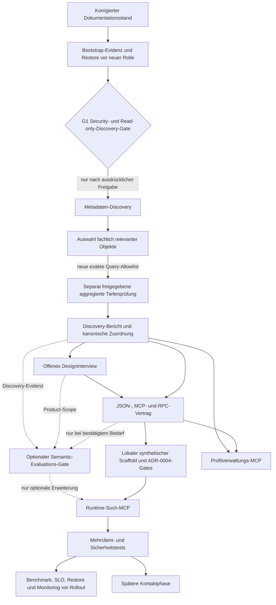

# Abhängige Entscheidungskarte

Stand: 2026-09-11

Status: Arbeitsdokument. Diese Karte ordnet vorhandene Fakten, akzeptierte
Entscheidungen, Vorschläge, Annahmen und offene Punkte. Sie trifft keine neue
Nutzerentscheidung und ändert keinen ADR-Status.

## Legende

<!-- markdownlint-disable MD013 -->

| Kennzeichen | Bedeutung |
| --- | --- |
| F | Lokal belegter Fakt oder dokumentierter Projektstand. |
| D | Ausdrücklich akzeptierte Entscheidung. |
| P | Vorschlag ohne Nutzerfreigabe. |
| A | Arbeitsannahme, durch Discovery zu prüfen. |
| O | Offener Punkt oder erforderliche Freigabe. |
| G | Gate; alle Voraussetzungen müssen erfüllt sein. |

<!-- markdownlint-enable MD013 -->

## Abhängigkeitsbild

Die Kontaktphase bleibt außerhalb von Release 1. Der Profilverwaltungs-MCP ist
gemäß ADR-0003 eine getrennte Trust Boundary und darf nicht in den
Runtime-Such-MCP integriert werden.

## Fakten

<!-- markdownlint-disable MD013 -->

| ID | Fakt | Evidenz | Wirkung |
| --- | --- | --- | --- |
| F-01 | Das Repository ist in Governance und Discovery-Vorbereitung; ein Anwendungsscaffold fehlt. | [Projektstatus](../project.md) | Keine Implementierungs- oder Stackentscheidung ist freigegeben. |
| F-02 | Es wurde noch kein verbundener Datenbankaudit durchgeführt; eine lokale statische Exportanalyse liegt vor. | [Statischer Bericht](crm-schema-static-analysis.md), [Discovery-Runbook](../runbooks/schema-discovery.md) | Exportfakten grenzen spätere Discovery ein, ersetzen Gate B aber nicht. |
| F-03 | Etwa 200.000 Kandidaten sind eine Projektschätzung; 179 Tabellen sind eine ungeprüfte Nutzerangabe. | [ADR-0002](../decisions/0002-search-design-interview.md) | Beide Zahlen müssen durch Metadaten-Discovery geprüft werden. |
| F-04 | Gate B1 V2 und der Plugin-Gate-P-Entwurf sind versioniert; beide bleiben ohne die jeweils verlangte Evidenz und Freigabe `NO-GO`. | [Projektstatus](../project.md), [Plugin Gate P](supabase-plugin-read-only-gate-draft.md) | Ein vorhandenes Gate-Dokument ist keine Zugriffsfreigabe. |
| F-05 | Release 1 ist auf allen Ausgabepfaden kontaktfrei. | [ADR-0002](../decisions/0002-search-design-interview.md), [Brief](../SUPABASE_CRM_MCP_IMPLEMENTATION_BRIEF.md) | Discovery-Ausgaben dürfen Kontakte ebenfalls nicht enthalten. |
| F-06 | Beide offiziellen Supabase-Skills und mehrere Distributionen desselben Supabase app/MCP sind installiert; die aktive Verbindung ist nicht projektgebunden oder read-only attestiert. | [Supabase-Tooling-Regeln](../agents/supabase-tooling.md) | Skills unterstützen Planung sofort; Live-Tools bleiben bis zu einem eigenen Gate blockiert. |
| F-07 | Das Ziel ist ein Produktionsprojekt mit echten Kandidatendaten. | Explizite Nutzerbestätigung vom 2026-09-11; [Plugin Gate P](supabase-plugin-read-only-gate-draft.md) | Der Entwickler-Plugin darf nicht direkt mit dem Ziel verbunden werden; Live-Evaluation nur gegen getrennte Nicht-Produktion ohne echte Personendaten. |
| F-08 | Der lokale Export hat den PII-/Secret-Preflight bestanden: 3.121 Zeilen, keine Treffer in den sieben sensiblen Kategorien. | [Statischer Bericht](crm-schema-static-analysis.md) | Die schema-only Analyse durfte fortgesetzt werden; die Rohdatei bleibt außerhalb von Git. |
| F-09 | Der Export enthält 100 vollständige Table-Blöcke mit 1.104 Spalten und je einem markierten Primary Key; Foreign Keys, Unique- und Identity-Constraints fehlen. | [Statischer Bericht](crm-schema-static-analysis.md) | Physische Namen und Typen sind Exportfakten; Beziehungen bleiben unbewiesen. |
| F-10 | Die RLS-Sektion nennt 188 Objekte; 88 davon besitzen keinen Table-/Column-Block im Export. | [Statischer Bericht](crm-schema-static-analysis.md) | Der Export ist unvollständig und beweist weder den Gesamtbestand noch effektive RLS-/Rechtewirkung. |
| F-11 | Die `crm_api`-Tabellenansicht zeigt 0 Tabellen; Views, Funktionen und RPCs wurden nicht inventarisiert. | Nutzerbereitgestellter Schema-Visualizer-Screenshot | Nur die Abwesenheit sichtbarer Tabellen ist belegt. |
| F-12 | Der `crm_auth`-Export enthält sechs Tabellen für User-/Employee-Mapping, Rollen, Berechtigungen, Rollenzuordnung und Scopes sowie sechs SELECT-Policies. | [Statischer `crm_auth`-Bericht](crm-auth-schema-static-analysis.md) | Auth-Bausteine sind physisch belegt; effektive Rechte, FKs und Tenant-Isolation bleiben offen. |
| F-13 | Die Supabase-Datenbank entstand aus einem Dump des inzwischen stillgelegten CRM; das CRM erhält keine neuen Änderungen. | Nutzerantworten zu Q10.1 und Q10.1a. | Keine dauerhafte Synchronisierung zum ehemaligen CRM geplant; andere Schreiber bleiben Discovery-Gegenstand. |
| F-14 | Lokaler SQL-Dump, OrbStack-Container und ZIP-Backup existieren; ihr lokaler Preflight wurde abgelehnt. | Nutzerantworten zu Q10.1c und Q10.1d. | Alle drei bleiben unverifiziert und sind kein Restore-Nachweis. |
| F-15 | Die aktuelle Supabase-Datenbank ist die vorläufige Arbeitsbasis für Discovery und Planung. | Q10.1e. | Vollständigkeit und Eignung bleiben unbestätigt. |

<!-- markdownlint-enable MD013 -->

## Akzeptierte Entscheidungen

<!-- markdownlint-disable MD013 -->

| ID | Entscheidung | Voraussetzung | Entsperrt |
| --- | --- | --- | --- |
| D-01 | LLM erzeugt nur validierte strukturierte Filter; kein beliebiges Runtime-SQL. | Keine | Kontrollierter Vertragsentwurf nach Discovery. |
| D-02 | PostgreSQL ist für Filterung, Ranking, Autorisierung und Pagination autoritativ; höchstens 50 Kandidaten pro Suchseite. | D-01 | Späterer RPC- und Testentwurf. |
| D-03 | Zuerst Sicherheitsvoraussetzungen, danach read-only Discovery, danach Fortsetzung des Interviews. | G1 | G2. |
| D-04 | Nicht genannte Filterkategorien bleiben inaktiv. | Späterer Vertrag muss dies abbilden. | Vertragstests nach G5. |
| D-05 | Bei null Treffern wird nicht automatisch gelockert; eine gelockerte Suche braucht ausdrückliche Zustimmung. | Erlaubte Lockerungen bleiben offen. | Spätere UX- und Vertragsspezifikation. |
| D-06 | Kontrollierte Berufssuchprofile sind nicht exklusiv; direkte Berufssuche bleibt möglich. | Discovery und kanonisches Modell. | Profilmodell nach G5. |
| D-07 | Der Profilverwaltungs-MCP ist vom read-only Runtime-Such-MCP getrennt; automatische Zuordnungen bleiben unveröffentlichte Vorschläge. | G5 und Modellfreigabe. | Planung des Profilverwaltungs-MCP. |
| D-08 | Der Nutzer übernimmt derzeit Product, Data, Security, Privacy/Legal, Operations und Discovery; eine zweite Person ist nicht verpflichtend. | Konkrete Prüfprozesse bleiben offen. | G1 kann vom Nutzer freigegeben werden. |
| D-09 | Es wird kein separates Supabase Development-/Staging-Projekt bereitgestellt. | Produktionsänderungen bleiben einzeln freigabepflichtig. | Planung am Zielprojekt; kein allgemeiner Apply. |
| D-10 | Jede Produktionsänderung folgt Audit, Plan, Restore-Nachweis, Dry-run, separater Freigabe, kleinem Apply und Post-Check. | Eigene Freigabe je Stufe. | Kontrollierter späterer Migrationsweg. |
| D-12 | ADR-0004: native-first SQL-Diff, synthetische Migrationen, lint/pgTAP/contract/CI und menschliche Produktionsfreigabe. | Discovery, Vertrag und Scaffold. | Automatisierte Entwicklung; Monitoring vor Rollout. |
| D-11 | Kurzfristig wird Option A additiv aufgebaut; dieselben kompatiblen Elemente werden danach schrittweise zum kanonischen Ziel D erweitert. | Discovery und Modellfreigabe bestimmen physische Rezepte. | Release-1-Pfad und spätere D-Migrationsschnitte. |

<!-- markdownlint-enable MD013 -->

## Vorschläge

<!-- markdownlint-disable MD013 -->

| ID | Vorschlag | Abhängigkeit | Status |
| --- | --- | --- | --- |
| P-01 | Jede neue oder geänderte Suche zeigt Filter und Profilauflösung vor Ausführung und wird erneut bestätigt. | Ursprüngliche Empfehlungsevidenz oder neue Nutzerentscheidung. | VORLÄUFIGER VORSCHLAG. |
| P-02 | Kategorien werden mit AND, Mehrfachwerte je nach Kategorie mit ANY/ALL und Ausschlüsse mit NOT verknüpft. | Q8-Detailentscheidung. | VORLÄUFIGER VORSCHLAG. |
| P-03 | Freitext wird unter Erhalt des Originals vorab normalisiert. | Datenlage, Datenschutz und Q8.5. | VORLÄUFIGER VORSCHLAG. |
| P-04 | Das Discovery-Gate nutzt die konservativen Grenzen des [Gate-B-Preflights](security-read-only-discovery-preflight-b.md). | Ausdrückliche Freigabe. | Zur Freigabe vorgelegt. |
| P-05 | Identity-Prüfung, Strukturmetadaten und sensitive Definitionen/Statistiken werden als B1, B2 und B3 separat freigegeben. Der erste B2-Scope ist auf `crm`, `crm_api` und `crm_auth` begrenzt. | Jeweils Review der vorherigen Stufe. | B1 V2 NO-GO; bei neuer Rolle V3-Paket nötig; B2/B3 ohne Launcher/Marker und eigene Freigabe BLOCKED. |
| P-06 | Ein Supabase-MCP kann später einen alternativen internen Discovery-Pfad bilden, wenn Projektbindung, read-only, minimale Features, Query-/Outputgrenzen und manuelle Freigabe in einer eigenen Gate-Version bewiesen sind. | [Plugin Gate P](supabase-plugin-read-only-gate-draft.md), neue technische Evidenz und ausdrückliche Nutzerfreigabe. | DRAFT / NO-GO; kein Bestandteil von Gate B. |
| P-07 | Semantische Suche wird nur über den [Evaluations-Gate](../research/semantic-search-evaluation-gate.md) geprüft: erst Baseline, dann gegebenenfalls `pgvector` gegen Vector Bucket/S3 Wrapper. | Discovery-Befunde, Product-Scope, Referenzset und vorab definierte Qualitäts-/SLO-Grenzen. | Eingeplant; keine Technologie gewählt und kein Release-1-Default. |
| P-08 | Der lokale `crm`-Export wird zuerst statisch und ohne Verbindung nach dem [Schema-Analyseplan](schema-analysis-tasklist.md) geprüft. | Sicherheits-Preflight der Datei. | PASS_WITH_GAPS; [Bericht](crm-schema-static-analysis.md) liegt vor und ersetzt Gate B nicht. |

<!-- markdownlint-enable MD013 -->

## Arbeitsannahmen

<!-- markdownlint-disable MD013 -->

| ID | Annahme | Prüfweg |
| --- | --- | --- |
| A-01 | Die Zielumgebung ist ein kompatibles Supabase/PostgreSQL-System. | SQL-GATE-001; Abbruch bei nicht freigegebener Version oder unerwarteter Umgebung. |
| A-02 | Eine dedizierte zeitlich begrenzte Identität kann ohne Owner-, Write-, Migration-, Superuser- oder BYPASSRLS-Rechte bereitgestellt werden. | SQL-GATE-002 bis SQL-GATE-007. |
| A-03 | Katalogmetadaten reichen aus, um relevante Tabellen für eine zweite, aggregierte Prüfstufe auszuwählen. | Metadaten-Allowlist und manueller Review. |
| A-04 | Kontrollierte IDs und für Search nutzbare Felder könnten existieren. | Erst Discovery; keine Vorfestlegung physischer Namen. |

<!-- markdownlint-enable MD013 -->

## Offene Punkte und Gates

<!-- markdownlint-disable MD013 -->

| ID | Offener Punkt | Voraussetzung oder Besitzer | Nachgelagerte Sperre |
| --- | --- | --- | --- |
| G1-01 | Bootstrap gemäß [Zugangsplan](access-plan-consolidated.md) klären; erst danach passende B1-Version mit Ziel-Alias, Attest, Identität, Zeitfenster, Hash, Limits, Stop-Kriterien und Retention ausdrücklich freigeben. | Nutzer in separater Sitzung. | Erste und einzige B1-Verbindung. |
| G1-02 | Dedizierte Identität bereitstellen und ihre effektiven Rechte mit der Gate-Allowlist prüfen. | Nutzer/Operations; bei neuer Rolle zuerst Restore, synthetische Probe und eigene Mutationsfreigabe. | Metadaten-Discovery. |
| G1-03 | Rohdatenverzeichnis mit restriktiven Rechten erzeugen; Repository-Ausgabe bleibt bis Redaktionsprüfung gesperrt. | Discovery-Sitzung. | Persistenz von Ergebnissen. |
| G1-04 | B1-Output prüfen und Gate B2 separat freigeben; B3 bleibt bis nach B2 gesperrt. | B1 PASS und Nutzerfreigabe. | Einfache Strukturmetadaten. |
| G1-05 | Falls der Supabase-MCP evaluiert werden soll, den [plugin-spezifischen Gate-P-Entwurf](supabase-plugin-read-only-gate-draft.md) ausschließlich gegen ein getrenntes Nicht-Produktionsprojekt ohne echte Personendaten schließen und testen. | `Always ask` ist attestiert; geeignetes Nicht-Produktionsprojekt, Projektbindung, read-only, Features, Outputgrenze und neue Freigabe fehlen. | Direkter Produktionspfad ist ausgeschlossen; optionaler Testpfad bleibt NO-GO. |
| G1-06 | Lokalen `crm`-Schemaexport ohne Ausgabe von Werten preflighten, statisch analysieren und redigieren. | [Schema-Analyseplan](schema-analysis-tasklist.md); kein DB- oder Plugin-Zugriff. | `PASS_WITH_GAPS`; Bericht grenzt relevante Objekte ein, ersetzt aber keine Gate-B-Evidenz. |
| G3-01 | Fachlich relevante Objekte anhand des Metadateninventars auswählen. | G2-Bericht. | Aggregierte Data-Quality-Abfragen. |
| G3-02 | Für jede Tiefenprüfung einen exakten, objektgebundenen SQL-Nachtrag freigeben. | G3-01. | Kandidatendaten oder Aggregate. |
| O-01 | Q4.5 einschließlich ursprünglicher Frage und Optionen. | Nutzer; nicht durch Discovery ableitbar. | Interviewabschluss. |
| O-02 | Q8.5 vollständig: Gesamt- oder relevante Erfahrung, Relevanzregeln, Überlappungen und Lücken. | Discovery-Befunde, dann Nutzerentscheidung. | Erfahrungsfiltervertrag. |
| O-03 | Authentifizierung, Tenant-Modell und RLS-Abbildung. | Discovery-Befunde und Nutzerentscheidung. | Runtime-Sicherheitsvertrag. |
| O-04 | Altersfilter: rechtliche Grundlage, Zweck und Darstellung. | Privacy/Legal-Entscheidung. | Release-Vertrag für Alter. |
| O-05 | Ranking, SLO, Hosting, Retention, Export, Verlauf, Cache und UI. | Discovery, Benchmark oder Nutzerentscheidung je Thema. | Spätere Implementierungsphasen. |
| O-06 | SEM-UC-01/02 und DQ-UC-01 fachlich freigeben sowie entscheiden, ob semantische Suche ein expliziter Modus sein darf. | Discovery-Befunde und Nutzerentscheidung; danach Evaluations-Gate. | Semantic Contract, Backend-Prototyp und ADR. |
| O-07 | Restore-Prüfweg, RTO/RPO, Zeitfenster, genaue A-Strukturen und Reihenfolge der D-Migrationsschnitte. | Discovery, Modellfreigabe und separate Betriebsentscheidungen. | Produktionsfreigaben für A und D. |

<!-- markdownlint-enable MD013 -->

## Kritischer Pfad

1. Die statischen Berichte für [`crm`](crm-schema-static-analysis.md) und
   [`crm_auth`](crm-auth-schema-static-analysis.md) menschlich prüfen.
2. Bootstrap-Evidenzweg und Restore-Voraussetzung aus dem
<!-- markdownlint-disable-next-line MD013 -->
   [Zugangsplan](access-plan-consolidated.md) klären; neue Rolle nur nach eigener
   synthetischer Probe, Preflight und Mutationsfreigabe.
3. Passende B1-Version binden und separat freigeben: V2 ist ein bestehender
   ungeprüfter Zugangsentwurf; für die neue Rolle muss V3 erst entstehen.
   Nach jedem Stop-Signal abbrechen.
4. Nur nach geprüftem B1 PASS einen neuen B2-Freigabetext für `crm`, `crm_api`
   und `crm_auth` vorbereiten.
5. Nur Metadaten inventarisieren; keine Kandidatenzeilen lesen.
6. Relevante Objekte auswählen und einen neuen exakten SQL-Nachtrag prüfen.
7. Erst nach separater Freigabe aggregierte Qualitäts- und Planprüfungen
   ausführen.
8. Befunde redigieren, klassifizieren und den Discovery-Bericht erstellen.
9. Offene Geschäftsentscheidungen mit belegten Befunden fortsetzen.
10. Nur bei bestätigtem semantischem Bedarf den Evaluations-Gate mit Baseline,
   Referenzset und isolierten Prototypen ausführen.
11. Verträge, lokalen synthetischen Scaffold und ADR-0004-Gates, Runtime und
    getrennte Profilverwaltung hinter eigenen Gates halten; Monitoring,
    Rückschaltung und Restore vor Rollout nachweisen.
12. Nach Modellfreigabe den minimalen additiven A-Layer als erste D-kompatible
    Schnitte planen und separat freigeben.
13. D nur in geprüften Migrationsschnitten erweitern; die jeweilige Quelle erst
    nach Abgleich, Cutover- und Rollback-Nachweis separat archivieren.

Die installierten Skills unterstützen die statische Prüfung in allen Schritten.
Der Live-Plugin verkürzt diesen kritischen Pfad nicht, solange G1-05 nicht
separat
entworfen, getestet und freigegeben wurde.

## Quellen

- [Projektstatus](../project.md)
- [Implementierungsbrief](../SUPABASE_CRM_MCP_IMPLEMENTATION_BRIEF.md)
- [ADR-0001](../decisions/0001-controlled-query-boundary.md)
- [ADR-0002](../decisions/0002-search-design-interview.md)
- [ADR-0003](../decisions/0003-separated-profile-administration-mcp.md)
- [Discovery-Runbook](../runbooks/schema-discovery.md)
- [Supabase-Tooling-Regeln](../agents/supabase-tooling.md)
<!-- markdownlint-disable-next-line MD013 -->
- [Evaluations-Gate für semantische Suche](../research/semantic-search-evaluation-gate.md)
- [Korrekturmatrix](../reviews/decision-reconstruction-corrections.md)

## Vollständige Arbeitszuordnung

[Anforderungsregister](../planning/release-1-requirements.md),
[Arbeitsplan](../planning/release-1-automation-tickets.md) und
[Änderungsentwürfe](../planning/decision-drafts.md) konkretisieren den Weg.
Optionale Semantik ist keine Pflichtkante des R1-Scaffolds. Der vollständige
Interviewabschluss bleibt bis zur ausdrücklichen Annahme von E-01 maßgeblich.
