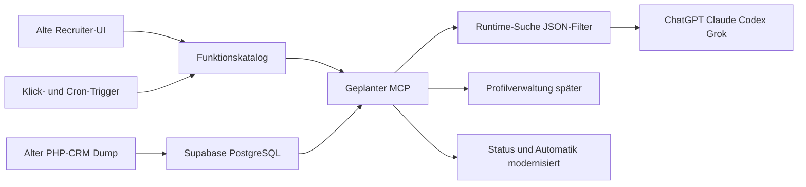

<!-- markdownlint-disable MD013 -->
# Briefing-Intro: Sachlage

Stand: 2026-09-13

Status: kurzer Einstieg für Partner und nächste Sessions. Kein Runtime-MCP,
kein App-Scaffold, keine auditierte Kandidatenzählung. Details bleiben in den
verlinkten Quellen.

## Ausgangslage

Die Vermittlung hat eine große Kandidatenbank im alten PHP-CRM. Dieses System
ist abgeschaltet. Der SQL-Dump wurde nach **Supabase PostgreSQL 17** importiert
und ist die aktuelle Arbeitsgrundlage (Q10). Die importierten Tabellen bleiben
kurzfristig unverändert. Release 1 legt eine additive, kompatible Schicht
darüber (Option A) und geht später in kleinen Schnitten in das kanonische
Zielmodell (Option D).

Es handelt sich um echte Personendaten in einem Produktionsprojekt. Der
Developer-Plugin/MCP darf sich nicht mit diesem Projekt verbinden.

## Größe der Bank

| Angabe | Wert | Status |
| --- | --- | --- |
| Projektschätzung | ca. 200.000 Kandidatenakten | Arbeitszahl, DURCH DISCOVERY ZU PRÜFEN |
| Katalog Gate B2 V3 | `crm.idk_kandidati` ≈ 122.000 Reltuples | Planner-Schätzung, keine gezählte Standzahl |
| Dump-Angabe | ca. 1,53 GiB, 179 Tabellen | Quelle für den Import, kein Restore-Beweis |
| Postgres-Katalog | 398 Relationen, 1960 Spalten in `crm` / `crm_api` / `crm_auth` | Gate B2 V3; ADR Q10.2q. Roh außerhalb Git |

Die 200.000 bleiben die kommunizierte Größenordnung. Die 122.000 sind die
bisherige Katalogschätzung der Kernakte. Beide Zahlen sind keine auditierte
Zählung.

## Ziel

Wir bauen einen **MCP-Server** über diese Postgres-Bank. ChatGPT, Claude,
Codex, Grok und andere MCP-Clients sollen damit arbeiten.

Der MCP übernimmt die Fähigkeiten des alten CRM-Frontends, **angepasst an
Supabase, modernisiert und optimiert** — gleiche Funktionen, nicht 1:1 das
alte PHP-SQL (Q21). Zusätzlich kommen die **manuellen und automatischen
Trigger** des alten CRM in denselben kontrollierten MCP-Rahmen.

Zwei getrennte Grenzen:

| MCP | Aufgabe |
| --- | --- |
| Runtime-Such-MCP | Suche, Profil lesen, Filteroptionen. LLM erzeugt nur einen validierten JSON-Filter. Postgres filtert, rangiert, paginiert. Maximal 50 Treffer. Kein LLM-SQL. |
| Profilverwaltungs-MCP | Später, getrennt: Berufssuchprofile entwerfen und veröffentlichen. Kein stilles Umschalten der Suchlogik. |

Module 11–16 (z. B. DIPL/Vertrag tiefer) sind für einen späteren zweiten MCP
gemerkt, nicht der jetzige Scan.

## Was aus dem alten CRM rein soll

### Recruiter-UI (Hauptsuche)

Maske `kandidati.php`: Alter, Führerschein, Erfahrung ja/nein,
Deutsch/Englisch, Gruppe, Bearbeitung, Prijave, Quelle, Staatsangehörigkeit,
Boravak EU, Struke, Schule, Smjer, DIPL-Status, Nostrifikation. Archiv default
raus. Leere Felder zählen nicht; gesetzte Felder mit UND.

Nicht in dieser alten Maske: drei Berufsschichten, Ort, Skills, Freitext,
Berufssuchprofil. Jahres-Erfahrung fehlt in der PHP-Maske; R1 ergänzt sie
(Q8.5.9, von–bis passender Jobs). Occupation liegt in Postgres, die alte UI
nutzt sie nicht.

### Manuelle Auslöser

Statusleisten und Alltagsklicks in `ajax.php` / `do.php`: Bearbeitung 0–8,
Prijave, Messenger, DIPL, Task-Force; Go-Online, Termin setzen/prüfen,
Interview da/nicht da, Dopuna, Dokumente.

### Automatik (Cron)

Go-Online aus Casting, Bot-Erinnerung unfertiges Profil, Install-Erinnerung,
Geburtstag, Termin-Einladung, Mitarbeiter-Mail bei fehlendem Terminausgang.
Mehrere alte Jobs sind im PHP tot oder auskommentiert.

### Nachrichten C 4–9

SMS/Viber/Push/Mail an Statuswechsel. Im neuen Produkt **default aus**,
einschaltbar. Kein 1:1-Wrap der alten Sender.

## Wer darf was

| Akteur | Sicht |
| --- | --- |
| Interner Vermittler (Sachbearbeiter, Teamleiter, Inhaber, Entwickler) | Ganzer Pool, alle Felder inklusive Kontakte |
| Kunde | Nie den ganzen Pool. Erst Vorschlagsfreigabe ohne Kontakte, dann Einstellungsfreigabe mit Kontakten des zugesagten Kandidaten |

## Wo wir stehen

PHP-Suche, Filter-SQL, Status/Klick/Cron und Nachrichten C 4–9 sind gelesen.
JSON-Filter R1 ist Entwurf, geprüft gegen PHP und Heft. Struke/Smjer =
Ausbildungsberuf. Jahresfilter R1: Q8.5.9 von–bis passender Jobs.
Ranking: größte `idk_kandidati.kandidat_id` zuerst. Ein Such-MCP, Tokens je
Rolle. Export: CSV/Excel,
max. 500, inkl. Kontakt/JMBG. Hosting/SDK-Version offen.

**Kein MCP-Server gebaut.** Bericht-Audit 2026-09-13 ausgeführt. JSON bleibt
Entwurf. Nächster Schritt: Nutzer nennt den Auftrag. Kein Scaffold, bis
ausdrücklich gestartet.

## Quellen

- [Projektstand](../project.md)
- [Domänenkontext](../../CONTEXT.md)
- [Implementierungsbrief](../SUPABASE_CRM_MCP_IMPLEMENTATION_BRIEF.md)
- [Inventar CRM-Scan](../discovery/crm-work-inventory.md)
- [Katalog Gate B2](../discovery/catalog-domain-mapping.md)
- [ADR-0001 JSON-Grenze](../decisions/0001-controlled-query-boundary.md)
- [ADR-0002 Interview](../decisions/0002-search-design-interview.md)
- [ADR-0003 Profil-MCP](../decisions/0003-separated-profile-administration-mcp.md)
