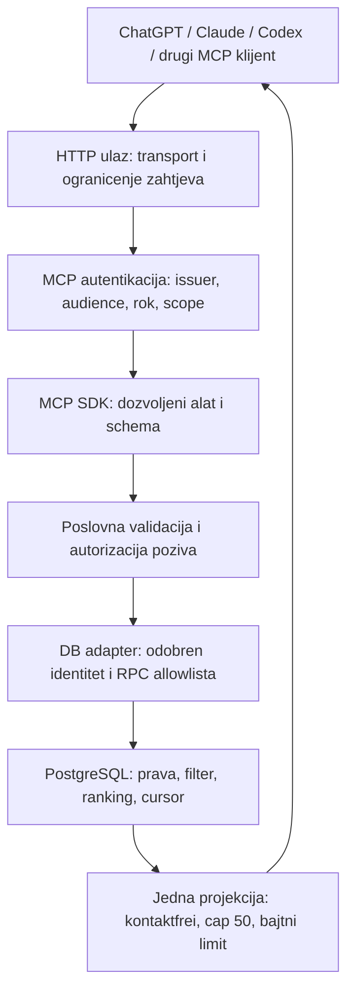

# Integracijski plan: MCP i Supabase SDK

Datum: 2026-09-11. Status: **ažurirani lokalni prijedlog / NEIMPLEMENTIRANO**.

## Mandat i granice

[Q11](../decisions/0002-search-design-interview.md#q11--sdk-erkenntnisse-in-die-projektplanung-übernehmen)
potvrđuje dokumentacijsku konsolidaciju i paralelnu provjeru. Ovaj plan
razrađuje [brief](../SUPABASE_CRM_MCP_IMPLEMENTATION_BRIEF.md), ne zamjenjuje
njegove poslovne zahtjeve. Izbor stacka, verzija, hostinga i auth modela ostaje
u AUTO-02 nakon discoveryja i DEC-01. Nema instaliranog ili testiranog
aplikacijskog SDK sklopa na osnovu ove dokumentacije.

[ADR-0001](../decisions/0001-controlled-query-boundary.md),
[ADR-0003](../decisions/0003-separated-profile-administration-mcp.md) i
[ADR-0004](../decisions/0004-automated-database-development.md) ostaju važeći.
SDK ne mijenja Gate B, ne daje razvojnom Supabase pluginu pristup produkciji
i ne odobrava migracije, javni endpoint ili vanjske upise.

## Preporučeni izbor i alternative

<!-- markdownlint-disable MD013 -->

| Sloj | Preporuka za evaluaciju | Šta ostaje naše |
| --- | --- | --- |
| MCP protokol | Službeni TypeScript MCP SDK v2 (`@modelcontextprotocol/server` i potreban runtime adapter) kao prvi kandidat. | Verzija protokola, tri uska alata i višeklijentska kompatibilnost. |
| Supabase pristup | `@supabase/server` ako odobren ugovor identiteta i tokena odgovara njegovim mogućnostima. | Autorizacija svrhe, opsega i DB identiteta; allowlista RPC-ja. |
| Middleware kompozicija | Prvo najmanji prikladni wrapper; zasebna `@supabase/middleware` pipeline samo za stvarne zajedničke potrebe. | Redoslijed, veličina zahtjeva, rate limit, cancellation i redakcija. |
| Alternativa adapteru | MCP SDK + eksplicitna provjera tokena + minimalni Supabase klijent kada wrapper ne može provesti odobreni ugovor. | Isti sigurnosni i contract gate; nema slabijeg fallbacka. |
| Python | Ostaje alternativa ako hosting ili razvojne potrebe prevagnu. | Navedeni Supabase JS paketi nisu Python middleware; auth adapter se posebno procjenjuje. |
| OpenAI model SDK | Nije potreban u osnovnom runtime toku; MCP klijent već strukturira namjeru. | Novi model poziv samo uz zaseban slučaj upotrebe, minimizaciju podataka i testove. |

<!-- markdownlint-enable MD013 -->

Paket `@supabase/server` koristi `supabase-js`; to nisu dvije suparničke
implementacije MCP-a. `@supabase/ssr` služi cookie sesijama eventualne web
aplikacije, ne uvodi se u header-based MCP put bez potrebe.

`@supabase/middleware`, njegova kompozicijska površina u Server paketu i
OAuth Protected Resource helper su označeni kao alpha. To se ne prenosi
automatski na cijeli `@supabase/server`. Alpha zahtijeva eksplicitnu odluku
u AUTO-02, fiksirane verzije, kompatibilan povratak i dokazan dodatni benefit.

Provjera službenog repozitorija nalazi v2 kao stable i razdvojene pakete;
OpenAI primjer s `@modelcontextprotocol/sdk` opisuje v1 u maintenance grani.
Time se koriguje ranija preporuka paketa iz razgovora. Prije izbora provjeriti
službeni release, podržani runtime i adapter zajedno; ne kopirati nepinovanu
install komandu ili miješati importe generacija. Ako klijentska matrica traži
stariji protokol, kompatibilnost se dokazuje odvojeno, ne pretpostavlja.
Provjerene činjenice, izvori i eventualni konflikt verzija žive u
[SDK-recherche](../research/mcp-supabase-sdk-integration.md).

## Ciljni tok i vlasništvo nad podacima

Shema prikazuje logičke odgovornosti, ne gotov redoslijed funkcija određenog
SDK-a. OAuth metadata i dozvoljeni preflight moraju biti dostupni prije auth
odbacivanja; poslovni MCP pozivi zahtijevaju važeći identitet.

1. **HTTP adapter** prima zahtjev uz TLS, provjeru Origin/Host prema odabranom
   transportu i ograničenje ulaza prije skupog parsiranja ili bufferiranja.
2. **Auth adapter** provjerava token namijenjen baš MCP resursu. Provjera
   potpisa nije sama provjera dozvoljene publike, svrhe ili CRM prava.
3. **MCP adapter** objavljuje samo `search_candidates`,
   `get_candidate_profile` i `get_filter_options`. Nazivi su ugovor alata,
   ne dokaz fizičkih PostgreSQL naziva ili potpisa.
4. **Aplikacijska granica** strogo provjerava polja, tipove, dozvoljene ID-ove,
   taksonomiju i verziju profila. Prava i tenant dolaze iz potvrđenog
   identiteta. Materijalna nejasnoća ne pokreće RPC.
5. **DB adapter** prima samo normalizirani filter i autorizirani kontekst.
   Koristi unaprijed određenu RPC, bez generičkog SQL-a ili izbora tabela iz
   modelskog inputa. Opći SDK klijent nije dio interfejsa domenske pretrage.
6. **Izlazni adapter** pravi jednu minimiziranu projekciju za
   `structuredContent` i tekstualni fallback. `_meta`, greške i traceovi
   nisu alternativni kanal za kontakte, CV, tajne ili skrivene kolone.

PostgreSQL ostaje autoritativan za ranking i paginaciju. Search cap je 50;
profil vraća jedan dozvoljeni zapis, a options ograničenu listu pojmova.
Opća potvrda svake pretrage ostaje prijedlog; Q7 traži potvrdu konkretnog
popuštanja filtera. SDK ne zaključuje Q8.5 ili druge otvorene semantike.

## Auth ugovor prije izbora wrappera

MCP resource server, authorization server i PostgreSQL/Data API su različite
uloge. `withOAuthProtectedResource` pomaže objavi metapodataka i izazova 401;
ne izdaje tokene i ne implementira sam cijeli OAuth tok ili poslovne dozvole.

AUTH-01 mora dokumentovati izdavaoca, audience/resource, scopes, consent,
refresh/revocation pravila, put do internog CRM aktera i downstream credential
za svaki prihvaćeni klijent. Dolazni MCP token ne prosljeđuje se Data API-ju.
Downstream pristup zahtijeva zaseban credential s dokumentovanom svrhom i
pravima; način njegovog izdavanja/razmjene ostaje OFFEN.

`withSupabase({ auth: 'user' })` ili `withRequiredClaims` mogu biti dio auth
adaptera ako zadovoljavaju taj ugovor. `withClaims` sam dopušta token-less
poziv, a `withSupabaseClient` sam ne provjerava token prije predaje klijentu.
Ni jedan naziv helpera nije dokaz MCP audience provjere ili zabrane DB upisa.

Runtime nema admin/secret/service-role/BYPASSRLS klijent. Čak i RLS-scoped
klijent može pisati ako to stvarna prava dopuštaju; read-only mora biti
proveden i negativno testiran u bazi. `readOnlyHint` je samo metapodatak.
Tenant model i eventualna veza s `crm_auth` ostaju DURCH DISCOVERY ZU PRÜFEN.

MCP SDK v2 već ima HTTP auth/handler primitive; prvo procijeniti njihovu
upotrebu s odobrenim verifierom. Supabase OAuth alpha wrapper nije obavezna
druga auth ovojnica. Svaka kontrola ima jednog izvršioca, uz dokumentovano
prenošenje provjerenog konteksta do handlera.

Identitet se veže za svaki zahtjev/poziv. Globalni promjenjivi auth klijent ili
cursor iz drugog konteksta ne smiju prenijeti prava. Pool, JWKS cache ili
transport mogu se dijeliti samo uz izolaciju osjetljivog konteksta i
dokumentovan lifecycle. Za eksplicitno podržane starije protokole posebno
testirati izolaciju sesija; session ID nikad nije credential.

## Profilverwaltung i mogućnost zamjene adaptera

Administrativni MCP zadržava zasebne identitete, ovlasti, deployment, audit i
rollback. Može dijeliti čiste ugovore i provjerene pomoćne module, ali ne
runtime credentiale, transport sesije ili opći admin client. Objavljivanje
profila ostaje poseban potvrđeni korak vezan za verziju i diff.

Auth i DB adapter imaju uske interfejse. Zamjena alpha middlewarea ne mijenja
filter ugovor, značenje profila, RPC semantiku ili format rezultata. Nema
paralelnog održavanja dvaju punih auth stackova kao preventivne optimizacije.

## Provjerljivi gateovi i radni paketi

Svi redovi ispod su **PLANIRANI / NIJE IZVRŠENO**. Nisu novi Linear ticketi.
Postojeći [radni paketi](release-1-automation-tickets.md) zadržavaju blockere;
SDK provjere razrađuju njihove kriterije iz
[registra](release-1-requirements.md).

<!-- markdownlint-disable MD013 -->

| Test | Paket / zahtjev | Dokaz za prolaz |
| --- | --- | --- |
| SDK-01 | AUTO-02/03; REQ-SDK-01 | Odobren stack i tačan skup runtime/SDK/adapter/protocol verzija; reproducibilan clean install iz lockfilea, typecheck/build i review zavisnosti; dokumentovan alpha izbor ili izostavljanje. |
| SDK-02 | AUTH-01; REQ-AUTH-01 | Cijeli OAuth tok i svi potrebni klijenti; missing/expired/wrong issuer/wrong audience/wrong scope/API-key-as-user odbijeni; metadata i izazovi dostupni; downstream token put dokazano ispravan. |
| SDK-03 | AUTH-01/02; REQ-AUTH-02 | Istovremeni korisnici i različiti scopes/sesije/cursori ostaju izolirani; povučena prava i istek prema dogovorenom ugovoru; DB write/tuđi zapis zabranjeni stvarnim sintetičkim DB testom. |
| SDK-04 | AUTO-05; REQ-CONTRACT-01 | Jedan verzionirani input/output/error/cursor ugovor; schema i runtime odbijaju unknown; isti minimizirani rezultat u tekstu/structuredContent; admin tool nije u runtime katalogu. |
| SDK-05 | OPS-01, CLIENT-01; REQ-SDK-01 | Streamable HTTP kroz stvarni runtime/proxy; za 2026-07-28 pojedinačni POST i request-scoped SSE/JSON, obavezni metadata headers, prekid i siguran retry; stariji session/GET/DELETE samo u zasebnoj kompatibilnoj matrici. Middleware ne troši tijelo dva puta niti blokira response streaming. |
| SDK-06 | OPS-01/02; REQ-LIMIT-01, REQ-PRIV-02 | Oversize/chunked ulaz odbijen u budžetu; timeout/cancel do DB-a, concurrency/backpressure i rate limit; secret/PII canary odsutan iz odgovora, grešaka, metapodataka i logova. |
| SDK-07 | SEARCH-01; REQ-SEARCH-01 | Pozitivni i negativni vertikalni slučaj od MCP poziva do kontrolisane RPC u sintetičkoj bazi; nula ostaje nula, cap i kontaktfreiheit provjereni. |
| SDK-08 | AUTO-03, CLIENT-01, REL-01; REQ-SDK-01 | Nadogradnja SDK-a ne mijenja ugovor/prava; prethodna kompatibilna verzija vraća se provjereno; klijentska matrica i sigurnosni testovi ponovljeni. |

<!-- markdownlint-enable MD013 -->

SDK-01 ne potvrđuje SDK-02–08. MCP Inspector je pomoć za protokol; nije dokaz
DB prava ili ukupne kompatibilnosti. Nepodržan ili nedostupan ciljni klijent
ostaje GAP, ne PASS. Numerički pragovi i matrica podrške dogovaraju se prije
testiranja, ne nakon viđenih rezultata.

## Optimizacije prema dokazu

- Jedan kanonski ugovor; schema/tipovi se izvode, poslovni test-oracle ostaje
  nezavisno pregledan. Nema dvije ručno održavane liste filtera.
- Wrapper prvo; zasebna pipeline samo kada smanjuje dupliranje stvarnih
  auth/limit/redaction pravila bez slabljenja granica.
- Za protokol 2026-07-28 koristiti pojedinačne POST zahtjeve bez protokolskih
  sesija ili GET stream endpointa. Stariji session-based transport uključiti
  samo ako odobrena klijentska matrica to zahtijeva, s posebnim testovima.
- Koristiti dozvoljene RPC projekcije i male rezultate, bez dodatnog LLM
  poziva ili client-side rankinga. SDK nije optimizator upita nad 200.000 redova.
- Mjeriti auth/JWKS, MCP, RPC i ukupnu latenciju odvojeno. Cache ključeva i
  connection reuse imaju kontrolisanu rotaciju/lifecycle; candidate-result
  cache i vektori ostaju iza postojećih zasebnih gateova.
- Vlastiti UI, Company Knowledge `search`/`fetch` adapter i MCP skill import
  ostaju naknadne opcije; ne proširuju tri osnovna alata niti blokiraju R1.

## Redoslijed i kriterij završetka

Sada: uskladiti dokumente, javne izvore i testni plan. Zatim postojeći
discovery → DEC-01 → AUTO-02 → AUTO-03. Poslije scaffolda AUTH-01 i AUTO-05
pripremaju sintetičke ugovorne testove paralelno s AUTO-04; SEARCH-01 ih
spaja s bazom. OPS/CLIENT/REL dokazuju cijeli odabrani sistem prije odvojenog
produkcijskog odobrenja.

Dokumentacija je završena kada su reference i statusi dosljedni, izvori
navedeni i dokumentacijski gate zelen. Sistem je funkcionalno završen tek
kada postoje izvršivi dokazi svih relevantnih SDK i R1 kriterija; ovaj plan
takav rezultat ne tvrdi.
